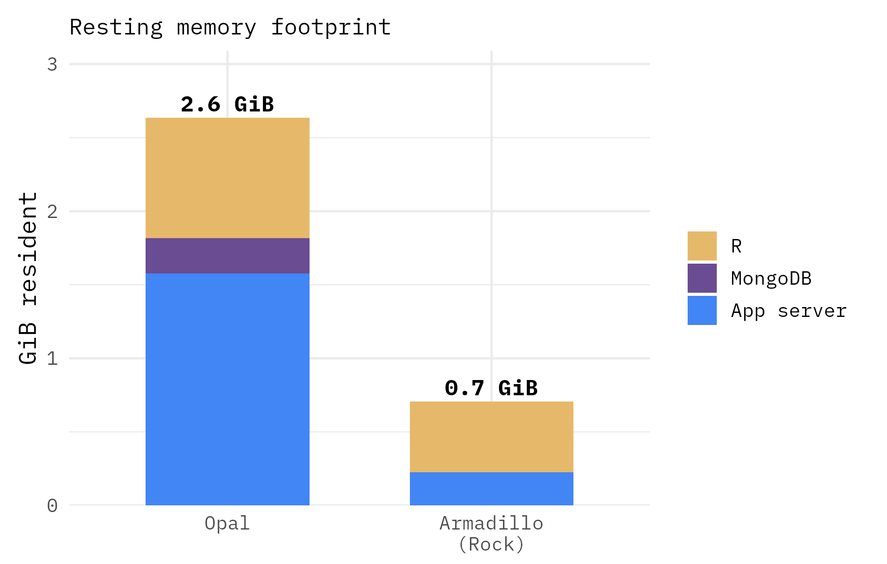
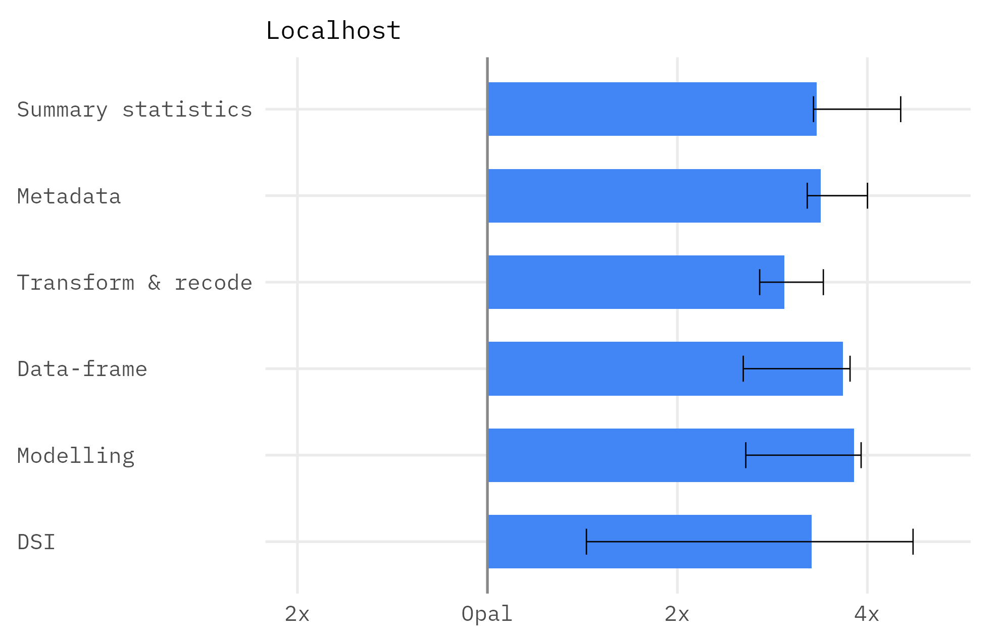
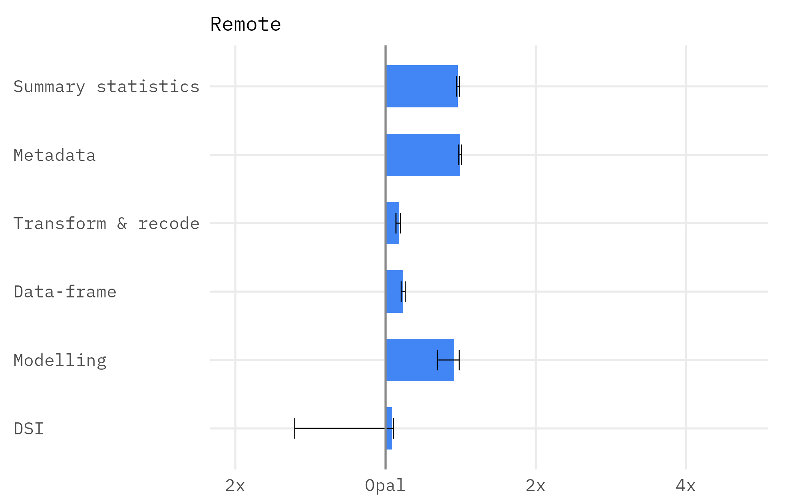
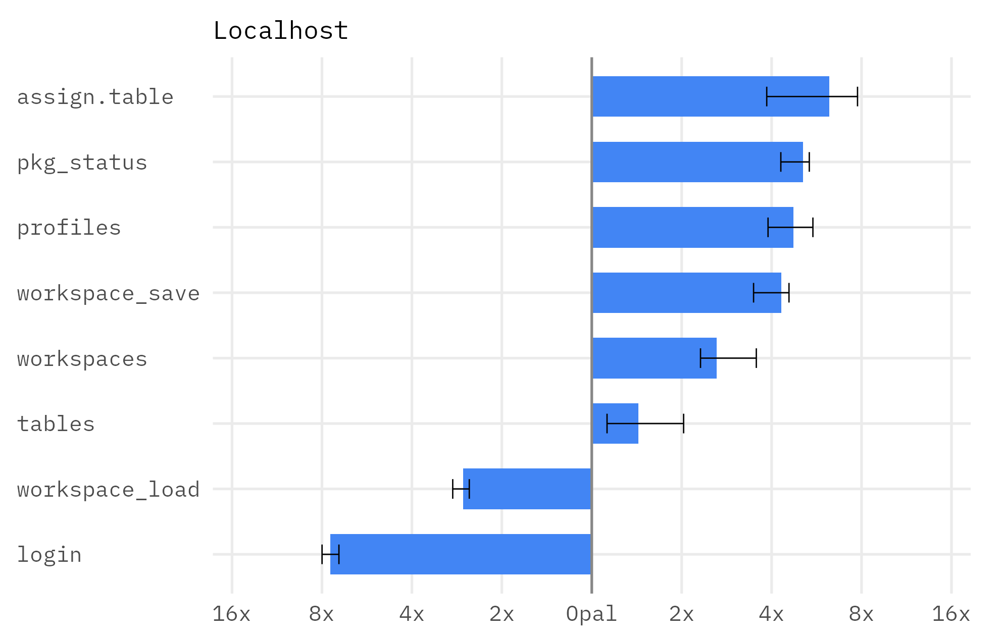
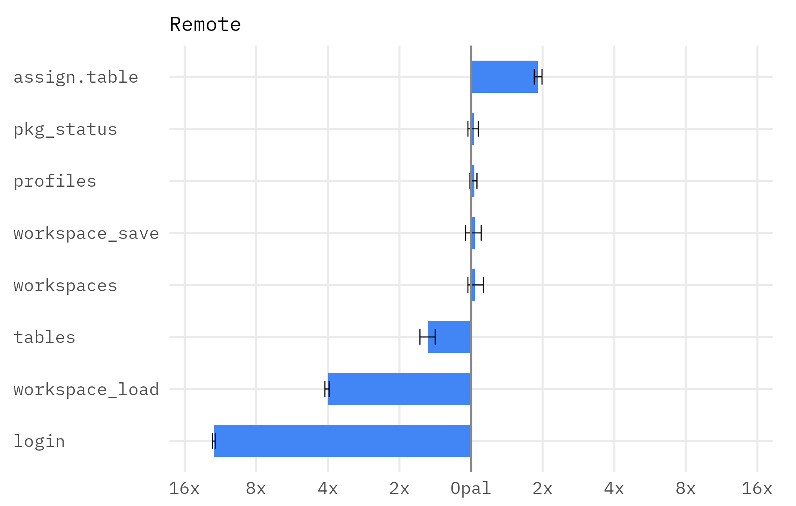

# Armadillo vs Opal

Performance benchmark

  

---
layout: section
---

# Background

---
layout: content
heading: Why benchmark?
section: Background
---

<v-clicks>

- We **assume** that Armadillo is faster than Opal — but we haven't systematically measured it
- We know Armadillo is more light-weight, but again we have not measured it
- Leon (NCC) asked for benchmarks to help choose between Armadillo and Opal
- Stats could be useful in the future when marketting Armadillo

</v-clicks>

---
layout: content
heading: Objectives
subheading: 'To test the following:'
section: Background
---

<ProcessCards size="lg" direction="column" :clicks="$clicks" :groups="[
  { steps: [
    { title: 'Footprint', desc: 'Resting memory and on-disk storage efficiency' },
    { title: 'Speed', desc: 'How fast Armadillo (Rock) and Opal are when deployed' },
  ] }
]" />

---
layout: section
---

# Methods

---
layout: content
heading: Servers tested
section: Methods
---

<table class="srv-tbl">
<thead><tr><th>Server</th><th>R engine</th><th>Host</th><th>Version</th><th>Spec</th></tr></thead>
<tbody>
<tr v-click="1"><td><b>Armadillo</b></td><td>Rock</td><td>armadillo-demo.molgenis.net</td><td>5.12.2</td><td>2 vCPU · 8 GiB</td></tr>
<tr v-click="1"><td><b>Armadillo</b></td><td>Rock</td><td>localhost</td><td>5.14.0-SNAPSHOT</td><td>2 vCPU · 8 GiB</td></tr>
<tr v-click="2"><td><b>Opal</b></td><td>Rock</td><td>opal.molgeniscloud.org</td><td>5.7.2</td><td>2 vCPU · 8 GiB</td></tr>
<tr v-click="2"><td><b>Opal</b></td><td>Rock</td><td>localhost</td><td>5.7.1</td><td>2 vCPU · 8 GiB</td></tr>
</tbody>
</table>

All R engines ran <b>dsBase 6.3.5</b>; client <b>dsBaseClient 6.3.0</b>.

---
layout: content
heading: Footprint
subheading: 'What was measured and how'
section: Methods
---

<table class="fp-tbl">
<thead><tr><th>Metric</th><th>Armadillo</th><th>Opal</th></tr></thead>
<tbody>
<tr v-click><td><b>Resting memory</b></td><td>Armadillo + Rock engine</td><td>Opal + MongoDB + Rock engine</td></tr>
<tr v-click><td><b>Data on disk</b></td><td>Example 10,000-row data, stored as Parquet</td><td>Same data file, stored in MongoDB</td></tr>
</tbody>
</table>

<b>How (idle):</b> <b>Memory</b> — containers via <code>docker stats</code> (RSS); Armadillo server (host JVM) via <code>vmmap</code> physical footprint. <b>Disk</b> — <code>du</code> per store.

---
layout: content
heading: Speed
subheading: Where the time goes
section: Methods
---

  The client-observed <b style="color:#333">round-trip</b> of a call is a layer of operations:
  Each element was measured as follows:

= 5 }">
  

    
= 1 }" style="flex:2.4;--c:#1E3A5F"><b>Network</b><small>round-trips on the wire</small>

    
= 2 }" style="flex:1.5;--c:#0097A7"><b>System overhead</b><small>serialise · protocol · dispatch · auth</small>

    
= 3 }" style="flex:1.1;--c:#E6B96A;--tc:#5c4410"><b>Server compute</b><small>the function runs in R</small>

    
= 4 }" style="flex:1.0;--c:#6A4C93"><b>Polling delay</b><small>client waits between async&nbsp;status&nbsp;checks</small>

  

  
= 5 }">═══ round-trip time ═══

  

    

      

Server compute

the function runs in R

      

command end &ensp;−&ensp; start
<b>Armadillo</b> <code>GET /lastcommand</code> &ensp;·&ensp; <b>Opal</b> <code>GET /datashield/…/command/{id}</code>

    

    

      

System overhead

serialise · protocol · dispatch · auth

      
(localhost round-trip) &ensp;−&ensp; compute

    

    

      

Network

round-trips on the wire

      
(remote round-trip) &ensp;−&ensp; compute &ensp;−&ensp; overhead

    

    

      

Polling delay

client waits between async&nbsp;status&nbsp;checks

      
DSI poll-sleep fixed at 2 ms (0.002 s)

    

  

---
layout: content
heading: Performance
subheading: Functions benchmarked
section: Methods
---
Speed was benchmarked using the following common functions:
<table class="fn-tbl">
<thead><tr><th>Family</th><th>n</th><th>Functions (dsBase server function)</th></tr></thead>
<tbody>
<tr><td><b>Summary statistics</b></td><td>5</td><td><code>meanDS</code> · <code>varDS</code> · <code>quantileMeanDS</code> · <code>corDS</code> · <code>tableDS</code></td></tr>
<tr><td><b>Metadata / introspection</b></td><td>8</td><td><code>classDS</code> · <code>dimDS</code> · <code>colnamesDS</code> · <code>lengthDS</code> · <code>levelsDS</code> · <code>numNaDS</code> · <code>lsDS</code> · <code>isValidDS</code></td></tr>
<tr><td><b>Transform &amp; recode</b></td><td>11</td><td><code>asFactorDS1</code> · <code>asFactorDS2</code> · <code>asIntegerDS</code> · <code>asCharacterDS</code> · <code>asDataMatrixDS</code> · <code>BooleDS</code> · <code>recodeValuesDS</code> · <code>recodeLevelsDS</code> · <code>changeRefGroupDS</code> · <code>repDS</code> · <code>replaceNaDS</code></td></tr>
<tr><td><b>Data-frame manipulation</b></td><td>6</td><td><code>dataFrameDS</code> · <code>dataFrameSubsetDS1</code> · <code>dataFrameSubsetDS2</code> · <code>cbindDS</code> · <code>mergeDS</code> · <code>reShapeDS</code></td></tr>
<tr><td><b>Modelling</b></td><td>5</td><td><code>glmDS1</code> · <code>glmDS2</code> · <code>glmSLMADS1</code> · <code>glmSLMADS.assign</code> · <code>lmerSLMADS2</code></td></tr>
<tr><td><b>DSI</b></td><td>9</td><td><code>rmDS</code> · <code>login</code> · <code>workspace_save</code> · <code>workspace_load</code> · <code>assign.table</code> · <code>tables</code> · <code>profiles</code> · <code>workspaces</code> · <code>pkg_status</code></td></tr>
</tbody>
</table>

---
layout: content
heading: Performance
subheading: Repeats & shuffling
section: Methods
---

Each call was timed over <b>5 shuffled passes</b> — every pass randomises the call order, then repeats each call <b>5 times</b>:

  

    
Pass 1

    

    
×5 reps

  

  

    
Pass 2

    

    
×5 reps

  

  

    
Pass 3

    

    
×5 reps

  

  

    
Pass 4

    

    
×5 reps

  

  

    
Pass 5

    

    
×5 reps

  

---
layout: section
---

# Results

---
layout: content
heading: Footprint
section: Results
subheading: Memory and disk space
---

  

    
    
  

---
layout: content
heading: Speed
subheading: Armadillo speed vs Opal
section: Results
---

  

    Armadillo
  

  
Opal round-trip ÷ Armadillo round-trip · log₂ scale

  

    
    
  

---
layout: content
heading: Speed
subheading: DSI variance
section: Results
---

  

    Armadillo
  

  
Opal round-trip ÷ Armadillo round-trip · log₂ scale

  

    
    
  

---
layout: content
heading: Speed
subheading: Where is Armadillo faster?
section: Results
---

<LatencyStack note="median total time (ms) per operation" :rows="[
  { backend: 'opal · remote', compute: 9.0, overhead: 72.3, network: 157.5 },
  { backend: 'armadillo-rock · remote', compute: 4.6, overhead: 21.4, network: 158.3 },
]"/>

---
layout: section
---

# Conclusions

---
layout: content
heading: Conclusions
section: Conclusions
---

<v-clicks>

- **Armadillo is faster than Opal** — locally **~3×** ; remotely **~1.2×**
- Deployment is dominated by **network latency** (~160 ms, shared) — so Armadillo's comparative advantage diminishes when deployed
- We should **improve the few operations where Armadillo did worse** — `login` and `workspace_load`
- We can confidently say that Armadillo is **quicker and more light-weight**
</v-clicks>

---
layout: content
heading: Feedback
subheading: "Open questions"
section: Conclusions
---

<v-clicks>

- Anything else worth measuring?
- Do we want to put these figures in the docs/website?

</v-clicks>
