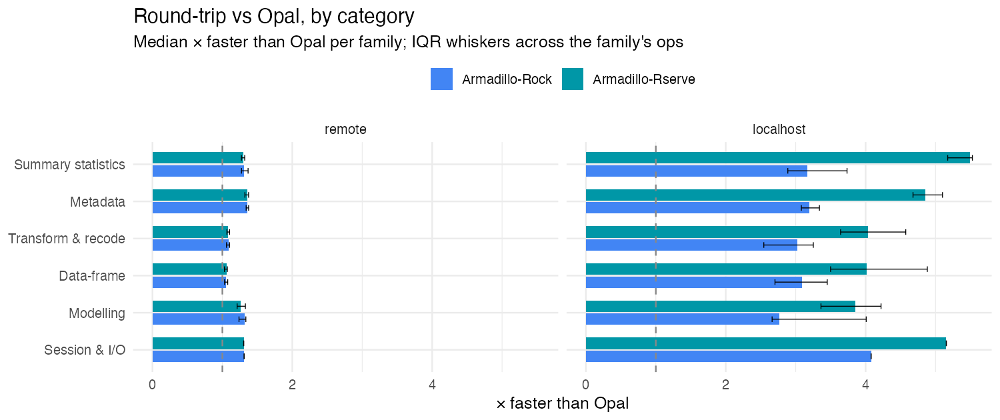
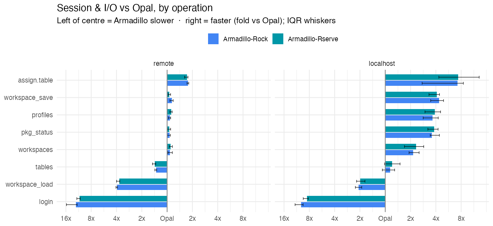
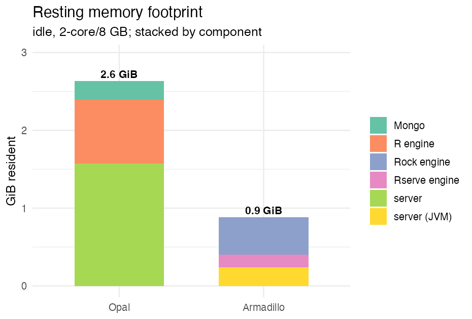
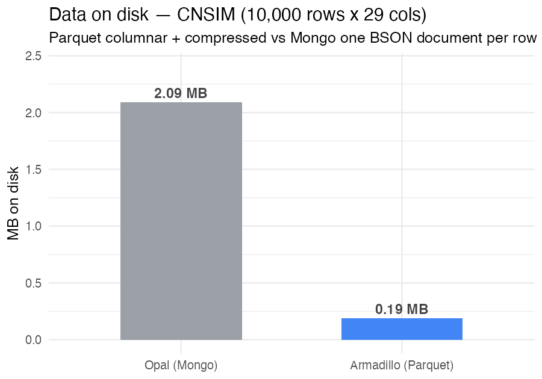

# Armadillo vs Opal

A DataSHIELD performance benchmark

  

---
layout: content
heading: Background
subheading: Why benchmark?
---

<v-clicks>

- We **assume** that Armadillo is faster than Opal — but we haven't systematically measured it
- We know Armadillo is more light-weight, but again we have not measured it
- Leon (NCC) asked for benchmarks to help choose between Armadillo and Opal
- Stats could be useful in the future when marketting Armadillo

</v-clicks>

---
layout: content
heading: Objectives
subheading: 'To test the following:'
---

<ProcessCards size="lg" direction="column" :clicks="$clicks" :groups="[
  { steps: [
    { title: 'Footprint', desc: 'Resting memory, install size and on-disk storage efficiency' },
    { title: 'Speed', desc: 'How fast Armadillo (Rock, Rserve) and Opal are when deployed' },
  ] }
]" />

---
layout: content
heading: Methods
subheading: Servers tested
---

<table class="srv-tbl">
<thead><tr><th>Server</th><th>R engine</th><th>Host</th><th>Spec</th></tr></thead>
<tbody>
<tr v-click="1"><td><b>Armadillo</b></td><td>Rock, Rserve</td><td>armadillo-demo.molgenis.net</td><td>2 vCPU · 8 GiB</td></tr>
<tr v-click="1"><td><b>Armadillo</b></td><td>Rock, Rserve</td><td>localhost</td><td>2 vCPU · 8 GiB</td></tr>
<tr v-click="2"><td><b>Opal</b></td><td>Rock</td><td>opal.molgeniscloud.org</td><td>2 vCPU · 8 GiB</td></tr>
<tr v-click="2"><td><b>Opal</b></td><td>Rock</td><td>localhost</td><td>2 vCPU · 8 GiB</td></tr>
</tbody>
</table>

---
layout: content
heading: Footprint
subheading: 'What was measured and how'
section: Methods
---

<table class="fp-tbl">
<thead><tr><th>Metric</th><th>Armadillo</th><th>Opal</th></tr></thead>
<tbody>
<tr v-click><td><b>Resting memory</b></td><td>JVM RSS + Rock/Rserve containers</td><td>server + Mongo + Rock containers</td></tr>
<tr v-click><td><b>Install size</b></td><td>Armadillo JAR + shared R-engine image</td><td>Opal + Mongo + shared R-engine image</td></tr>
<tr v-click><td><b>Data on disk</b> same 10,000-row file uploaded to each</td><td><code>CNSIM.parquet</code> — columnar, compressed</td><td>Mongo <code>value_set</code> — one BSON doc per row</td></tr>
</tbody>
</table>

---
layout: content
heading: 'Methods: performance'
subheading: Understanding DataSHIELD performance
---

The client-observed time of any DataSHIELD call is a stack of layers:

<TimeBar :clicks="$clicks" :segments="[
  { label: 'Network', desc: 'round-trips on the wire', color: '#1E3A5F', flex: 2.4 },
  { label: 'System overhead', desc: 'serialise · protocol · dispatch · auth', color: '#0097A7', flex: 1.5 },
  { label: 'Server compute', desc: 'the function runs in R', color: '#E6B96A', textColor: '#5c4410', flex: 1.1 },
]" caption="═══ round-trip time ═══" :start-empty="true" />

---
layout: content
heading: 'Methods: performance'
subheading: 'What was measured and how'
---

  
Quantity

  
Measured as

  
<b style="color:#6A4C93">Remote round-trip</b>

  
ms — latency of one call

  
— <b style="color:#B9852A">Compute</b>

  
server clock (command end − start)

  
— <b style="color:#0097A7">Overhead</b>

  
localhost round-trip − compute

  
— <b style="color:#1E3A5F">Network</b>

  
remote round-trip − compute − overhead

Median of <b>25 reps</b> (5 shuffled passes × 5), backends <b>interleaved</b> · poll fixed at <b>2 ms</b> · one 10,000-row frame

---
layout: content
heading: Methods
subheading: '2. Benchmarking the performance'
---
Speed was benchmarked using the following common functions:
<table class="fn-tbl">
<thead><tr><th>Family</th><th>n</th><th>Functions (dsBase server function)</th></tr></thead>
<tbody>
<tr><td><b>Summary statistics</b></td><td>5</td><td><code>meanDS</code> · <code>varDS</code> · <code>quantileMeanDS</code> · <code>corDS</code> · <code>tableDS</code></td></tr>
<tr><td><b>Metadata / introspection</b></td><td>8</td><td><code>classDS</code> · <code>dimDS</code> · <code>colnamesDS</code> · <code>lengthDS</code> · <code>levelsDS</code> · <code>numNaDS</code> · <code>lsDS</code> · <code>isValidDS</code></td></tr>
<tr><td><b>Transform &amp; recode</b></td><td>11</td><td><code>asFactorDS1</code> · <code>asFactorDS2</code> · <code>asIntegerDS</code> · <code>asCharacterDS</code> · <code>asDataMatrixDS</code> · <code>BooleDS</code> · <code>recodeValuesDS</code> · <code>recodeLevelsDS</code> · <code>changeRefGroupDS</code> · <code>repDS</code> · <code>replaceNaDS</code></td></tr>
<tr><td><b>Data-frame manipulation</b></td><td>6</td><td><code>dataFrameDS</code> · <code>dataFrameSubsetDS1</code> · <code>dataFrameSubsetDS2</code> · <code>cbindDS</code> · <code>mergeDS</code> · <code>reShapeDS</code></td></tr>
<tr><td><b>Modelling</b></td><td>5</td><td><code>glmDS1</code> · <code>glmDS2</code> · <code>glmSLMADS1</code> · <code>glmSLMADS.assign</code> · <code>lmerSLMADS2</code></td></tr>
<tr><td><b>Session &amp; I/O</b></td><td>9</td><td><code>rmDS</code> · <code>login</code> · <code>workspace_save</code> · <code>workspace_load</code> · <code>assign.table</code> · <code>tables</code> · <code>profiles</code> · <code>workspaces</code> · <code>pkg_status</code></td></tr>
</tbody>
</table>

---
layout: content
heading: Results
subheading: 1. Overall performance
---

Median × faster than Opal per family; above the dashed line = Armadillo faster · IQR whiskers. <b>②</b> shows why.

---
layout: content
heading: Results
subheading: "1b. Session & I/O — mixed: big wins, two sharp losses"
---

Fold-change vs Opal (0 = parity; right = Armadillo faster, left = slower), IQR whiskers. Locally Armadillo is much faster on most session ops (<code>assign.table</code> ~7×, <code>workspace_save</code> ~4×) but far slower on <code>login</code> and <code>workspace_load</code> (cold session / container spawn). Remotely the wins compress toward parity while those two stay slow — the targets of Conclusion #5.

---
layout: content
heading: Results
subheading: 2. Decomposing the latency
---

<LatencyStack :rows="[
  { backend: 'opal · remote', compute: 5.0, overhead: 68.9, network: 225 },
  { backend: 'armadillo-rock · remote', compute: 3.9, overhead: 19.3, network: 225 },
  { backend: 'armadillo-rserve · remote', compute: 2.1, overhead: 18.2, network: 225 },
]"/>

median milliseconds per operation · remote

---
layout: content
heading: Results
subheading: "3. Deployment footprint"
---

  
  

Idle, 2-core/8 GB. <b>Memory</b>: Opal ~2.6 GiB vs Armadillo ~0.9 GiB (~3× lighter — no Mongo, leaner server). <b>Disk</b>: CNSIM 10k stored ~11× smaller as Parquet than as Mongo BSON. Install: both need the ~5.6 GB R-engine image; Opal adds ~2 GB (server + Mongo).

---
layout: content
heading: Conclusions
---

<v-clicks>

- **Armadillo is faster than Opal** — locally **~3–4×** ; remotely **~1.2×**
- **Rserve is faster than Rock** — notably so **locally**
- **Deployment is dominated by network latency** (~220 ms, shared) — so Armadillo's comparative advantage **diminishes** when deployed
- **Rserve probably isn't worth persevering with** — its advantage is minimal once deployed.
- **We should improve the few operations where Armadillo did worse** — `login` and `workspace_load` (cold session / container spawn)
- **Armadillo's leaner stack is a real deployment win** — ~3× less resting memory and ~11× smaller on disk

</v-clicks>

---
layout: content
heading: Feedback
subheading: "Open questions"
---

<v-clicks>

**Anything else worth measuring?**

- **Concurrency / capacity** — memory per active session, and how many concurrent sessions before a bigger VM is needed (Rock spawns a process per session; Rserve pools)
- **Peak memory & CPU under load** — headroom, and whether the R engines saturate their cores
- **Cold-start / warm-up** — first-call latency after a fresh start

**Other**

- Do we want to put these figures on the **website**?

</v-clicks>
