# Opal vs Armadillo
A function-by-function performance benchmark of DataSHIELD backends

  
<strong>Tim Cadman</strong>

  
Senior Data Scientist

  
  

---
layout: content
heading: What we compared
subheading: Three backends, one client
---

- Three DataSHIELD backends, all on localhost, driven by the **same dsBaseClient (6.3.5)**:
  - **Opal** — Obiba's reference server
  - **Armadillo (default)** — a fresh R session spun up per request
  - **Armadillo (Rock / Rserve)** — a persistent R session pool
- **~140 functions** exercised: the whole dsBaseClient `ds.*` surface plus the server round-trip `datashield.*` (DSI) calls
- Each call uses its **real dsBaseClient smoke-test form**, on the **real test data inflated to 100,000 rows × 30 variables**
- Metric is **operations per second**: run each function in a tight loop for 10 s, count completed calls, repeat **× 3**

---
layout: content
heading: How to read the charts
subheading: Speed relative to Opal
---

- Each bar is one function. The dashed line at **0** is **equal speed to Opal**.
- **← Left = Opal faster**, **Armadillo faster = right →**, measured in **fold units** (so "2x" = twice Opal's rate), clipped at 6x.
- Two bars per function:
  - Blue — Armadillo **default**
  - Gold — Armadillo **Rock / Rserve**
- The thin whisker shows the **min–max across the 3 repetitions** — how stable the measurement was.

---
layout: content
heading: Headline result
subheading: Persistent R sessions win; cold sessions don't
---

- **Rock / Rserve beats Opal on 100 of 109 functions** (median **1.5× faster**) — a warm, pooled R session avoids per-call startup.
- **Armadillo default is slower than Opal on 72 of 109** (median **0.75×**) — every call pays to spin up a fresh R session.
- **Opal wins login by ~10×**: Armadillo's first call in a session is dominated by session startup (`login` ≈ 0.4 ops/s vs Opal's 4.3).
- Once a session is warm, the ranking flips — `logout`, descriptives and matrix algebra are **2–4× faster** on Rock/Rserve.
- Median throughput: **Opal 7.0**, **default 4.7**, **Rock/Rserve 10.4** ops/s.

---
layout: section
---

# Function-by-function

One category per slide

---
layout: chart-full
heading: Metadata & inspection
---

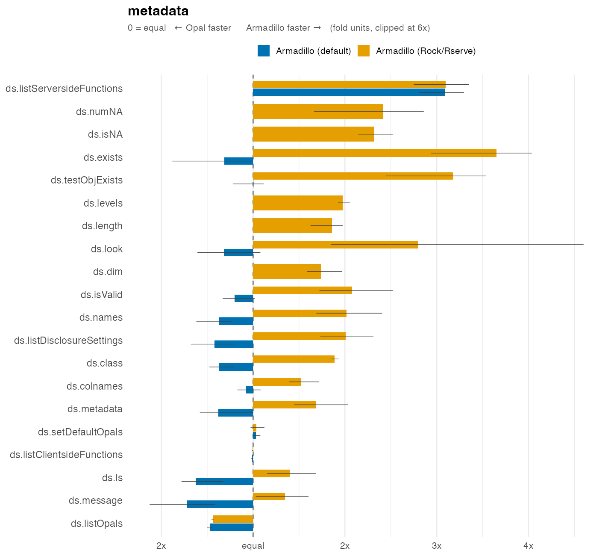

---
layout: chart-full
heading: DSI — server round-trips
---

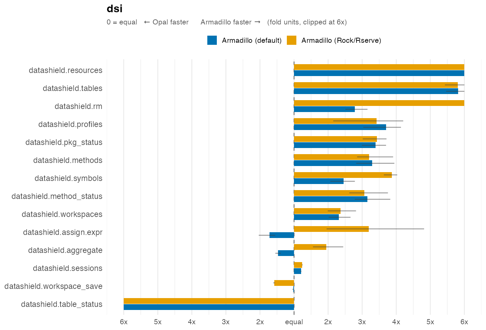

---
layout: chart-full
heading: Type coercion
---

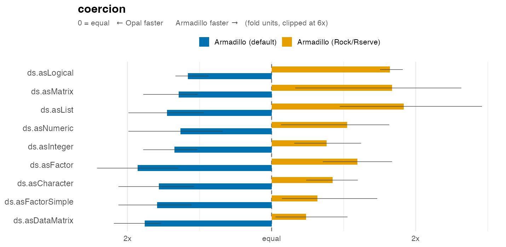

---
layout: chart-full
heading: Matrix algebra
---

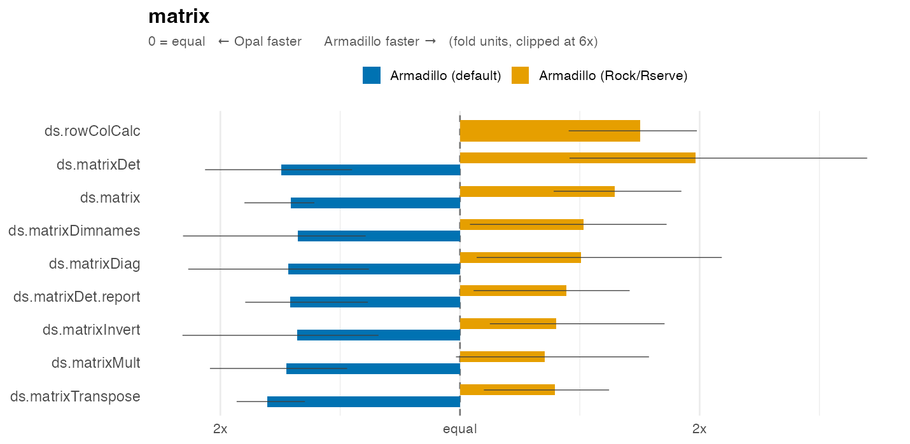

---
layout: chart-full
heading: Descriptive statistics
---

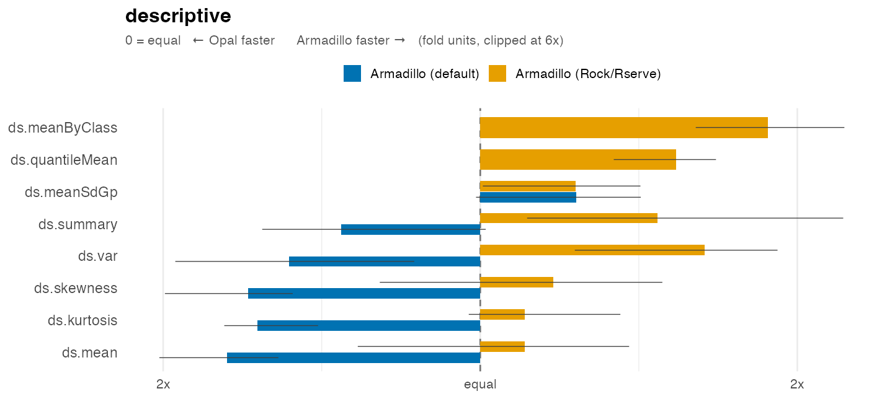

---
layout: chart-full
heading: Transformations
---

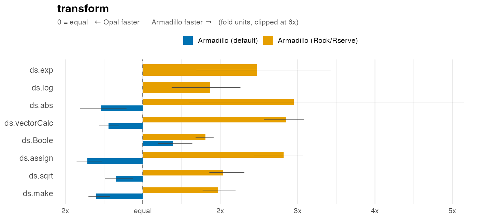

---
layout: chart-full
heading: Data-frame operations
---

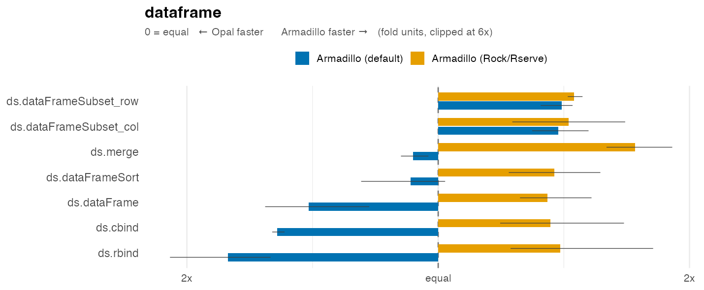

---
layout: chart-full
heading: Generalised linear models
---

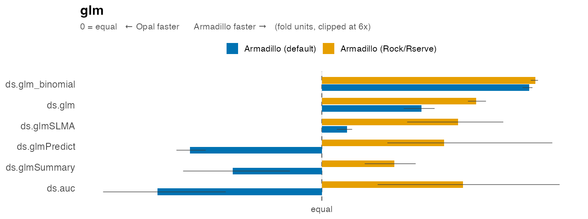

---
layout: chart-full
heading: Plotting
---

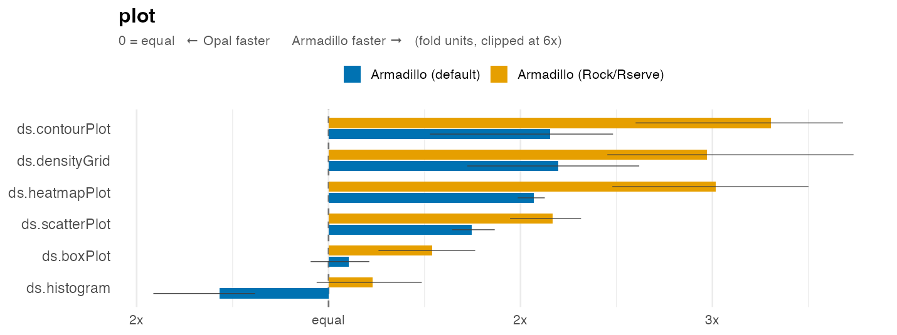

---
layout: chart-full
heading: Tabulation
---

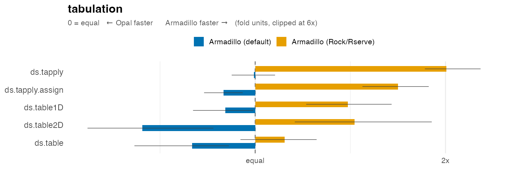

---
layout: chart-full
heading: Correlation & covariance
---

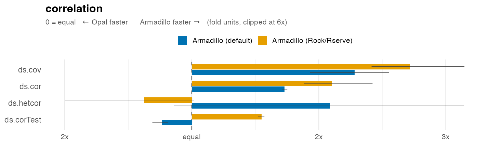

---
layout: chart-full
heading: Splines
---

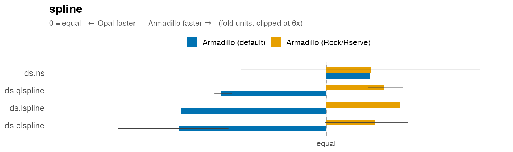

---
layout: chart-full
heading: Vector operations
---

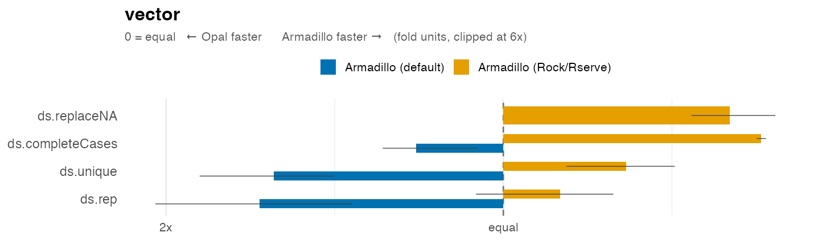

---
layout: chart-full
heading: Recoding
---

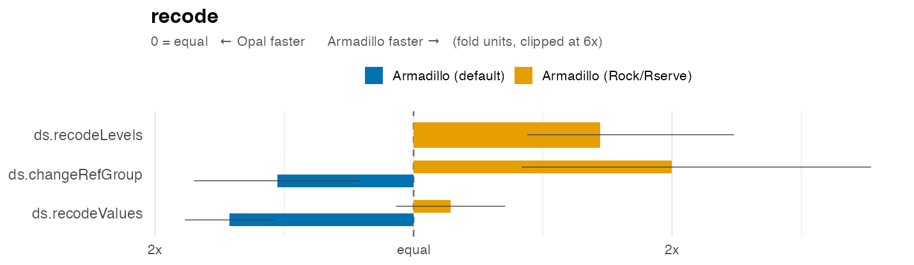

---
layout: chart-full
heading: Reshaping
---

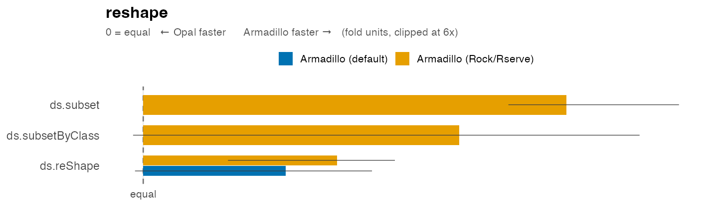

---
layout: chart-full
heading: Session — login / logout / load
---

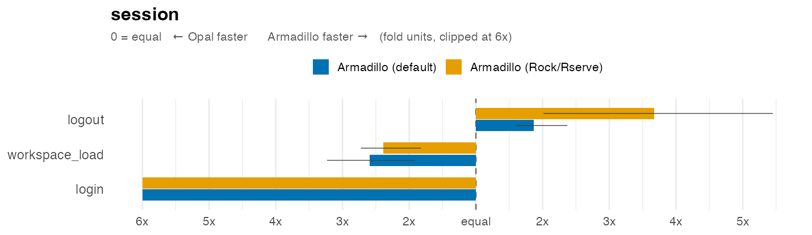

---
layout: chart-full
heading: Growth charts
---

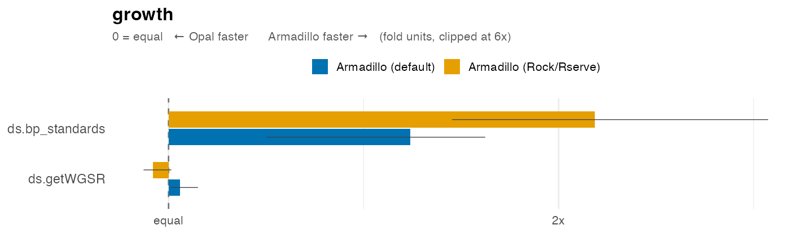

---
layout: chart-full
heading: Imputation
---

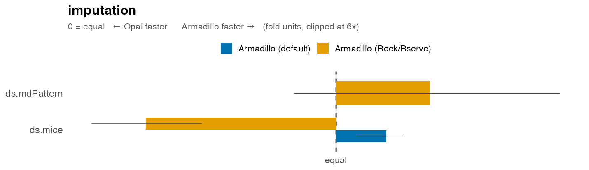

---
layout: chart-full
heading: Lists
---

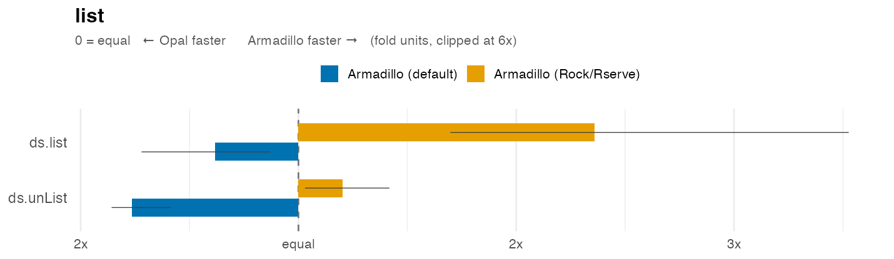

---
layout: chart-full
heading: Mixed-effects models
---

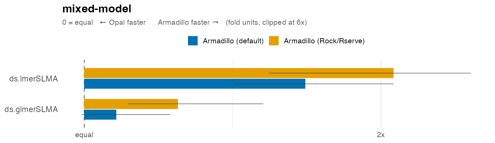

---
layout: chart-full
heading: Distributional tests
---

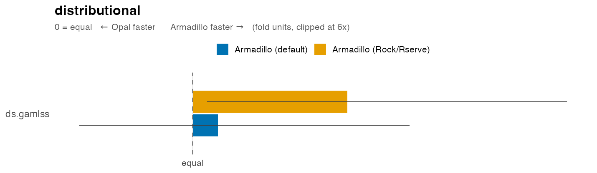

---
layout: chart-full
heading: Object management
---

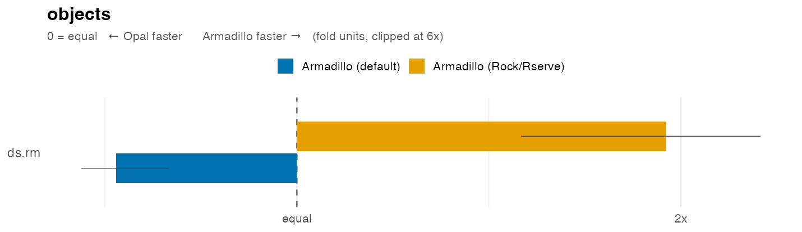

---
layout: chart-full
heading: Survival
---

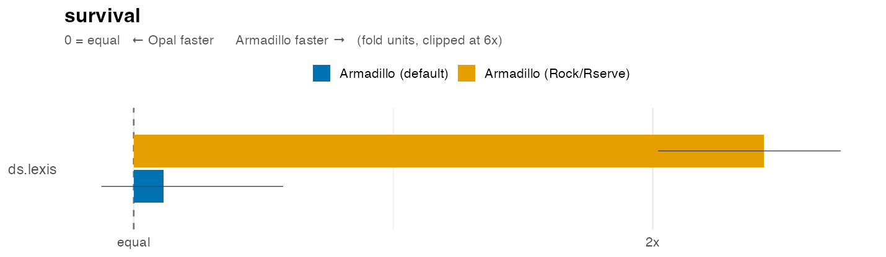

---
layout: section
---

# Takeaways

- **Rock / Rserve is the fast path** — persistent R sessions make Armadillo faster than Opal on almost every function (median 1.5×).
- **Cold-session overhead is real** — the default profile pays R-startup on every call and trails Opal; it hurts most on cheap, high-frequency calls.
- **First login favours Opal** — worth keeping in mind for short, interactive sessions.
