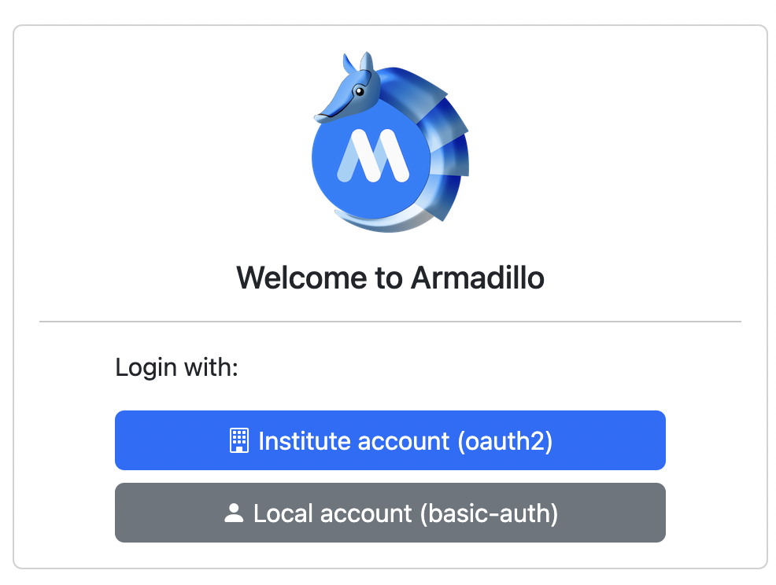
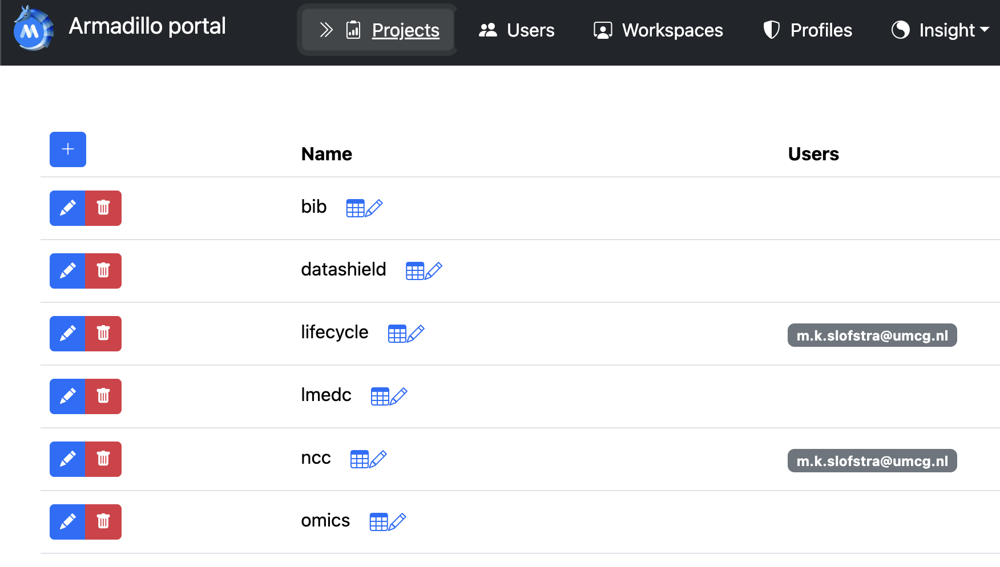
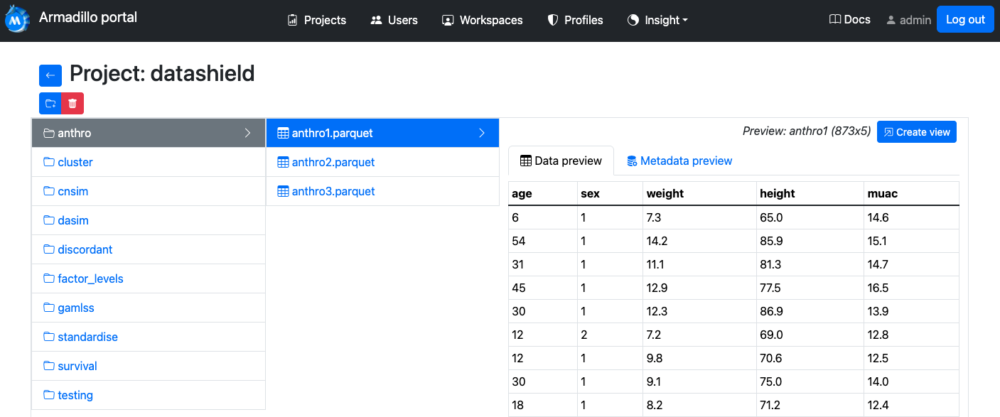
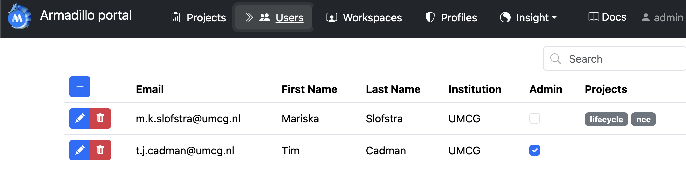
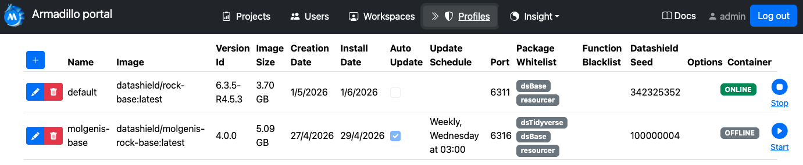
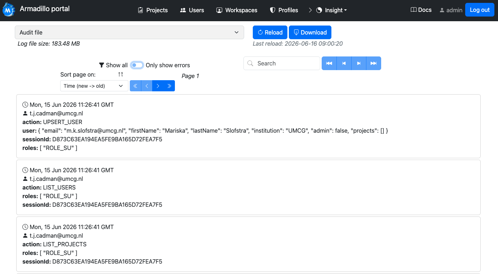
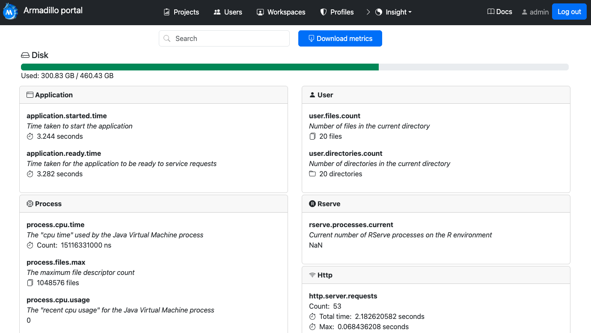
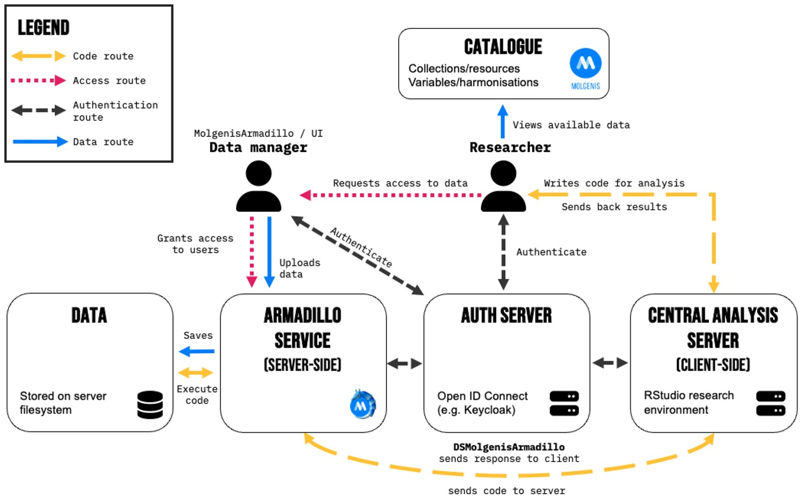
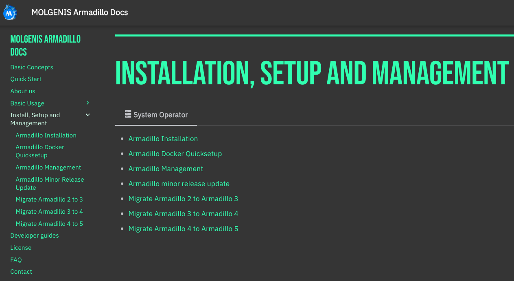
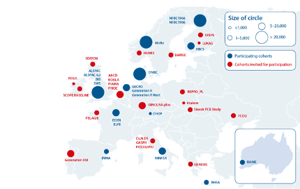

# MOLGENIS Armadillo
A lightweight server for federated analysis

  
<strong>Tim Cadman</strong>

  
Senior Data Scientist

  

---
layout: content
heading: Our team
---

<!-- Replace each 

 with .jpg" /> once photos are added -->

  

    
    
Tim Cadman

    
Data Scientist

  

  

    
    
Mariska Slofstra

    
Software Developer

  

  

    
    
Dick Postma

    
Ops

  

  

    

      
    

    
Ruben Veenstra

    
Ops

  

  

    
    
Erik Zwart

    
Data Manager

  

  

    
    
Niels Kikkert

    
Team leader

  

  

    
    
Morris Swertz

    
PI

  

---
layout: content
heading: What is DataSHIELD?
subheading: Bringing the analysis to the data
---

- Open-source, R-based platform for **privacy-preserving analysis** of biomedical, healthcare and social-science data
- Architecture consists of collection of:
    - (i) R-packages (user end) & (ii) java application installed alongside data

---
layout: content
heading: How DataSHIELD works
---

<DatashieldArchitectureFinal />

---
layout: content
heading: Deploying DataSHIELD
subheading: 
---

To run DataSHIELD, each data owner installs a <strong>java application</strong> on a local server or VM. Two implementations exist:

  

    <h3>Armadillo</h3>
    
Lightweight server developed and maintained by UMCG as part of the <strong>MOLGENIS</strong> software suite.

  

  
= 1 }]">
    <h3>Opal</h3>
    
Multipurpose database and data harmonisation platform developed and maintained by <strong>OBiBa</strong>.

  

---
layout: content
heading: Armadillo
subheading: "Goal: Making running DataSHIELD easier"
---

- <strong>Open-source server</strong> designed to securely store data and run DataSHIELD analysis
- Remove database engines so large tables can be served on modest hardware
- No need for a sysadmin to maintain a DataSHIELD server - one time install
- Integrated with **Life Sciences Authentication (LS AAI)** — no passwords in R

---
layout: content
heading: Armadillo
subheading: Key features
---

- <strong>User Interface (UI)</strong> for data managers to create projects, upload data, manage users
- Accompanying R package for data management
- Easy to add or update **profiles** that provide the analysis tools
- Connection to Armadillo managed using <strong>OIDC token-based authentication</strong>

---
layout: content
heading: Features
subheading: OIDC Authentication
---

- Armadillo delegates login to a **separate authentication server** via **OpenID Connect (OIDC)**
- Users **self-register** on the auth server with their **institutional login**
- Only users granted admin permission can log in to the UI

---
layout: content
heading: Features
subheading: Manage projects and data
---

- Data are grouped into **projects** (e.g. per study or consortium)
- Each project can be shared with specific users
- Admins can add, edit and remove projects directly from the UI

---
layout: content
heading: Features
subheading: Data storage
---

- Data stored on the **server filesystem as Parquet files** 
- Upload through the **UI** (drag & drop) or the **R package**
- Organise into folders and tables; preview without downloading

---
layout: content
heading: Features
subheading: Users & permissions
---

- Add and remove users; grant access **per project**
- Mark trusted accounts as **admin**

---
layout: content
heading: Features 
subheading: Analysis profiles
---

- **Profiles** = versioned collections of DataSHIELD packages as Docker images
- Control which packages and functions are permitted via **whitelist / blacklist**
- Run side by side in separate containers for reproducibility

---
layout: content
heading: Features
subheading: Audit log
---

- **Audit log** of every action — who connected and what they ran
- **Search**, sort, and filter to   **errors only**
- Download the log for external monitoring

---
layout: content
heading: Features 
subheading: Server metrics
---

- Live **server metrics** — disk usage, JVM/process, Rserve
- Per-user directory and file counts
- Download metrics for monitoring and alerting

---
layout: content
heading: Deployment
---

  

- Deployed alongside a **Central Analysis Server (CAS)** — a containerised JupyterHub environment for researchers
- Secured behind an NGINX reverse proxy with IP white-listing restricting access to the CAS

---
layout: content
heading: Deployment
subheading: 'Step 1: install Armadillo'
---

- **Linux server** with Java and Docker
- Connect to the **central authentication service**
- UMCG can also **host it for you** (we often do)

---
layout: content
heading: Deployment
subheading: 'Step 2: install profile containers'
---

- A **profile** = a bundle of analysis tools you trust for a study
- Create an **NCC-specific profile** or reuse an existing one

---
layout: content
heading: Deployment
subheading: 'Step 3: upload data and give access'
---

---
layout: content
heading: Federated multi-center analysis
subheading: Active networks maintained by MOLGENIS
---

- **H2020 LifeCycle** (11 nodes) — *Early stressors and lifecourse health*
- **H2020 ATHLETE** (11 nodes) — *Advancing tools for human exposome research*
- **NDTD** (4 nodes) — *NL network for difficult-to-treat depression*
- **JOIN-MIND** (4-node pilot) — *NL data infrastructure for mental health indicators*

See <a href="https://molgeniscatalogue.org/">molgeniscatalogue.org</a> for more information

---
layout: content
heading: Demo
---

---
layout: content
heading: Armadillo vs Opal
subheading: Feature comparison
---

  

  
= 1 }">Armadillo

  
= 1, dim: $clicks < 1 }">Opal

  
What it is

  
= 1 }">Lightweight DataSHIELD server

  
= 1, dim: $clicks < 1 }">DataSHIELD server plus additional features

  
Built for

  
= 1 }">DataSHIELD federated analysis

  
= 1, dim: $clicks < 1 }">Full data management: storage, harmonisation, metadata, cataloguing

  
Storage

  
= 1 }">Filesystem — Parquet files

  
= 1, dim: $clicks < 1 }">Relational DB (MySQL, PostgreSQL, MariaDB) or MongoDB

  
Advantages

  
= 1 }">Easy to deploy, fewer dependencies, user-friendly, maintained and deployed by UMCG

  
= 1, dim: $clicks < 1 }">Additional features e.g. harmonisation, cataloguing, advanced admin options

  
Disadvantages

  
= 1 }">Lacks additional functionality of Opal

  
= 1, dim: $clicks < 1 }">
    More dependencies, heavier infrastructure, UI more complex
  

---
layout: content
heading: Documentation and resources
---

- **Armadillo documentation** — [molgenis.github.io/molgenis-service-armadillo](https://molgenis.github.io/molgenis-service-armadillo/)
- **Github repo** — [github.com/molgenis/molgenis-service-armadillo](https://github.com/molgenis/molgenis-service-armadillo)
- **Armadillo paper** — [doi.org/10.1093/bioinformatics/btae726](https://doi.org/10.1093/bioinformatics/btae726)
- **MOLGENIS Catalogue** — [molgeniscatalogue.org](https://molgeniscatalogue.org)

Questions? <strong>support@molgenis.org</strong>

