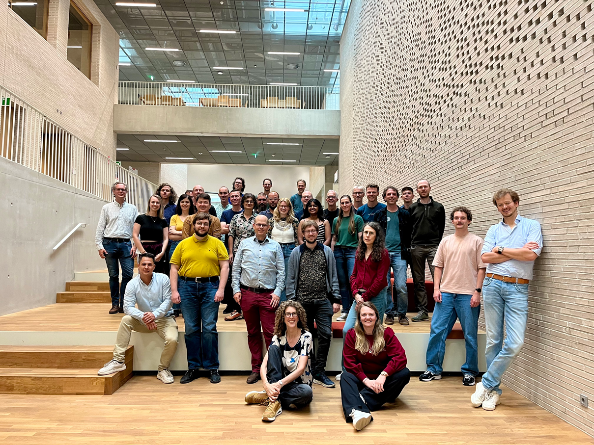

# MOLGENIS Armadillo
A lightweight server for federated analysis using DataSHIELD (and Flower)

  
<strong>Tim Cadman</strong>

  
Senior Data Scientist

  
  

---
layout: content-img-right
heading: Background
subheading: MOLGENIS
image: ./public/molgenis-ecosystem.png
imageScale: '100'
---

- **MOLGENIS** data infrastructure accelerates **multi-center health research collaborations** — 60 projects, 35 FTE
- Armadillo is part of the **MOLGENIS suite**, which also includes the **EMX2 data warehouse** and the **MOLGENIS catalogue**

---
layout: content
heading: Our team
---

Armadillo

  

    
    
Tim Cadman

    
Data Scientist

  

  

    
    
Mariska Slofstra

    
Software Developer

  

  

    
    
Dick Postma

    
Ops

  

  

    

      
    

    
Ruben Veenstra

    
Ops

  

  

    
    
Erik Zwart

    
Data Manager

  

  

    
    
Niels Kikkert

    
Team leader

  

  

    
    
Morris Swertz

    
PI

  

Wider MOLGENIS

  

---
layout: content-img-right
heading: Background
subheading: Armadillo
image: ./public/armadillo-logo-border.png
imageScale: '60'
---

- We built Armadillo (**since 2019**) to help a large consortium that was struggling with other implementations of federated (DataSHIELD) analysis
- Armadillo is now **mature** and a **cornerstone of the core DataSHIELD community project**
- **30 nodes** maintained by us (and an unknown number maintained by others)

---
layout: content-img-right
heading: Background
subheading: Active MOLGENIS networks
image: ./public/cohort-map-new.png
imageScale: '100'
---

- **H2020 LifeCycle** (11 nodes) — *Early stressors and lifecourse health*
- **H2020 ATHLETE** (11 nodes) — *Advancing tools for exposome research*
- **NDTD** (4 nodes) — *NL network for difficult-to-treat depression*
- **JOIN-MIND** (4-node pilot) — *NL network for mental health indicators*

---
layout: content
heading: What is DataSHIELD?
subheading: Bringing the analysis to the data
---

- Open-source, R-based platform for **privacy-preserving analysis** of biomedical, healthcare and social-science data
- Architecture consists of collection of:
    - (i) R-packages (user end) & (ii) java application installed alongside data

---
layout: content
heading: How DataSHIELD works
---

<DatashieldArchitectureFinal />

---
layout: content
heading: Deploying DataSHIELD
subheading: 
---

To run DataSHIELD, each data owner installs a <strong>java application</strong> on a local server or VM. Two implementations exist:

  

    <h3>Armadillo</h3>
    
Lightweight server developed and maintained by UMCG as part of the <strong>MOLGENIS</strong> software suite.

  

  
= 1 }]">
    <h3>Opal</h3>
    
Multipurpose database and data harmonisation platform developed and maintained by <strong>OBiBa</strong>.

  

---
layout: content-img-right
heading: What is Armadillo?
subheading: Design
image: ./public/armadillo-logo-border.png
imageScale: '75'
imageWidth: '22'
imageAlign: 'flex-start'
---

- **Open-source server** designed to securely   store data and run DataSHIELD analysis
- **Lightweight, easy to install and operate**:
    - Remove database engines so large tables  can be served on modest hardware
    - No need for a sysadmin to maintain server
    - Easy to add or update **profiles** that   provide the analysis tools
- Integrated with **LS AAI** — no passwords in R

---
layout: content-img-right
heading: What is Armadillo?
subheading: Features
image: ./public/armadillo-logo-border.png
imageScale: '75'
imageWidth: '22'
imageAlign: 'flex-start'
---

- **Backend** data storage, access management   & Docker container management
- **User Interface (UI)**  for data managers 
    - create projects & upload data 
    - manage users 
    - manage DataSHIELD packages
- **R package** for data management
- *Ongoing:* **Flower** integration 

---
layout: content-img-right
heading: Features
subheading: 'OIDC authentication'
image: ./public/ui-login.png
imageScale: '85'
---

- Armadillo delegates login to a separate **authentication server** via OpenID Connect (OIDC), e.g. **SURFconext, Life Science AAI, SRAM**
- Users **self-register** on the auth server with their **institutional login**
- Data managers at each node grant researcher access
- Only users granted admin permission can log in to the UI

---
layout: content-img-right
heading: Features
subheading: Manage projects and data
image: ./public/ui-projects.png
imageScale: '100'
---

- Data are grouped into **projects**   (e.g. per study or consortium)
- Each project can be shared with   specific users
- Admins can add, edit and remove   projects directly from the UI

---
layout: content-img-right
heading: Features
subheading: Data storage
image: ./public/ui-data.png
imageScale: '100'
---

- Data stored on the server filesystem as **Parquet files** 
- Upload through the **UI** (drag & drop) or   the **R package**
- Create **views** for different research projects so data don't need to be   uploaded twice

---
layout: content-img-right
heading: Features 
subheading: Analysis profiles
image: ./public/profile-packages.png
imageScale: '100'
---

- **Profiles** = versioned collections of DataSHIELD packages as Docker images (e.g. core statistical functions,   exposome package)
- UMCG actively manages profiles in the **DataSHIELD community**
- Can create a **custom profile** for   NCC projects or reuse existing

---
layout: content-img-right
heading: Features 
subheading: Analysis profiles
image: ./public/ui-containers.png
imageScale: '100'
---

- Run **multiple profiles side by side** in separate containers for reproducibility
- Control which packages and functions are permitted via **whitelist / blacklist**
- **Start, stop and add** profiles from the UI

---
layout: content-img-right
heading: Features
subheading: Users & permissions
image: ./public/ui-users.png
imageScale: '100'
---

- Add and remove users; grant access   **per project**
- Mark trusted accounts as **admin**

---
layout: content-img-right
heading: Features
subheading: Audit log
image: ./public/ui-logs.png
imageScale: '100'
---

- **Audit log** of every action — who connected and what they ran
- **Search**, sort, and filter to **errors only**
- Download the log for external monitoring

---
layout: content-img-right
heading: Features 
subheading: Server metrics
image: ./public/ui-metrics.png
imageScale: '100'
---

- Live **server metrics** — disk usage, JVM/process, Rserve
- Per-user directory and file counts
- Download metrics for monitoring   and alerting

---
layout: content-img-left
heading: Deployment
subheading: 1. Central Analysis Server (CAS)
image: ./public/armadillo-overview.png
imageScale: '100'
---

- Deployed alongside a **Central Analysis Server (CAS)** — a containerised JupyterHub researcher environment
- CAS lets us control researcher environment (e.g. package versions)

---
layout: content-img-right
heading: Deployment
subheading: '2: Install Armadillo'
image: ./public/docs-install.png
imageScale: '100'
---

- **On-premises support** — we help you install Armadillo on your own server
- UMCG can also **host it for you** on the **UMCG Azure Cloud**
- Contact **support@molgenis.org**
- Support via the DataSHIELD Slack community **#armadillo-support**

---
layout: content
heading: Deployment
subheading: Variants
---

- **Docker Quickstart** (`docker-compose.yml`) — evaluation / training with Keycloak as OIDC
- **Native Linux install** (systemd) via installation script — *production and Docker management*
- **Kubernetes** (Helm deployment) — advanced cloud deployments

**Requirements**
- Linux · Java 21 · Docker engine
- SSL frontend (Nginx with certificate) and a domain name

Hardware requirements

  
Participants

  
Memory (GB)

  
Disk (GB)

  
CPU cores

  
0–20,000

  
8

  
100

  
4

  
20,000–70,000

  
16

  
100

  
4

  
70,000 +

  
32

  
150

  
8

---
layout: content
heading: Deployment
subheading: 3. Security
---

- **SSL certificate** (Nginx)
- **Firewalling** — only whitelist the Central Analysis Server and the IPs of data managers
- **Update regularly**
- Data stored on disk on the VM (`/usr/share/armadillo/data`) — **not publicly available**
- **Back up** the data directory (`/usr/share/armadillo/data`) and configuration (`/etc/armadillo/`)

---
layout: content
heading: Demo
---

---
layout: content
heading: Potential advantages for NCC
subheading: To be discussed…
---

  
= 1 }">
    <h3>Install</h3>
    
Lightweight, with fewer dependencies

  

  
= 2 }">
    <h3>User experience</h3>
    
More intuitive UI; the extra Opal features may not be needed for NCC

  

  
= 3 }">
    <h3>Control</h3>
    
We maintain Armadillo — not dependent on a partner (OBiBa) outside the network

  

  
= 4 }">
    <h3>Deployment</h3>
    
Proven workflow with CAS, auth server and nodes already deployed >30 sites

  

---
layout: content
heading: Documentation and resources
---

- **Armadillo documentation** — [molgenis.github.io/molgenis-service-armadillo](https://molgenis.github.io/molgenis-service-armadillo/)
- **Github repo** — [github.com/molgenis/molgenis-service-armadillo](https://github.com/molgenis/molgenis-service-armadillo)
- **Armadillo paper** — [doi.org/10.1093/bioinformatics/btae726](https://doi.org/10.1093/bioinformatics/btae726)
- **MOLGENIS Catalogue** — [molgeniscatalogue.org](https://molgeniscatalogue.org)

Questions? <strong>support@molgenis.org</strong>

