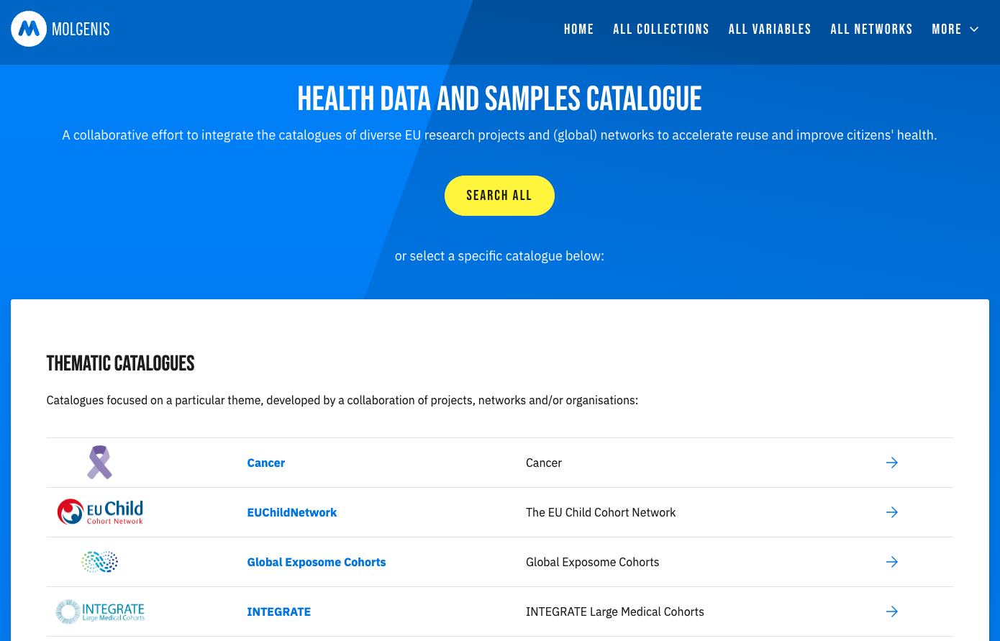
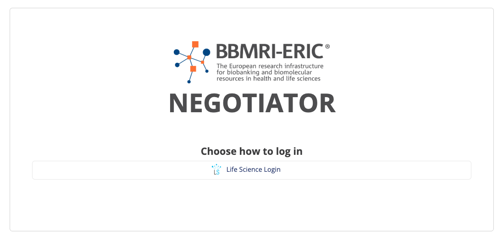
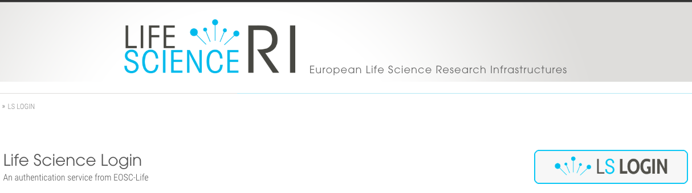
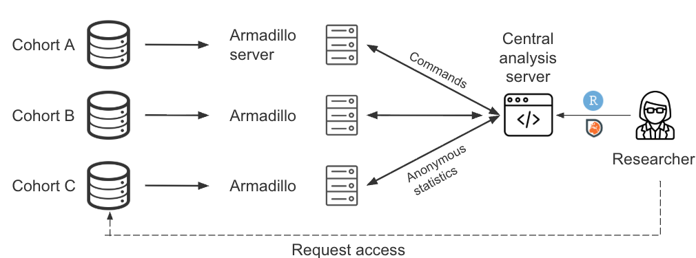

# From Data Discovery to Federated Analysis
Supporting the Research Journey

  
<strong>Tim Cadman</strong>

  
Senior Data Scientist

---
layout: content-img-right
heading: The problem
subheading: A fragmented researcher journey
image: ./public/screenshot-combining-data.jpeg
---

- Large quantities of existing data (e.g. cohort studies, biobanks)
- Combining data sources increases statistical power and enables replication
- However, researchers face a fragmented landscape when trying to find and reuse data

---
layout: content
heading: Our Journey
subheading: From FAIR at Source to FAIR Research Federations
---

  

  
Challenge

  
Solution

  
Local data

  
Not structured or reusable

  
Harmonise to established open standards

  
Catalogue

  
Collections not discoverable

  
Open source metadata catalogue

  
Request

  
Months lost negotiating collection-by-collection

  
Central point of access for all requests

  
Access

  
Each holder manages permissions separately

  
Federated identity & access

  
Analyse

  
Data transfer carries ethical, legal and practical difficulties

  
Federated analysis — data never moves

---
layout: content
heading: "Our approach"
subheading: "One open stack — same at every scale"
---

  

    Local data
    Harmonise to established standards
  

  

    Catalogue
    MOLGENIS meta-data catalogue
  

  

    Request
    BBMRI-ERIC Negotiator
  

  

    Access
    LS AAI + OIDC
  

  

    Analyse
    DataSHIELD + Molgenis Armadillo
  

---
layout: content
heading: Local Data
subheading: Harmonise to established standards
---

- *Placeholder — content to be added*

---
layout: content
heading: Catalogue
subheading: Making collections discoverable
---

• Open source metadata catalogue — information about data, not the data itself

• Search across consortia for harmonised variables and collections

• Upload variables and Common Data Model mappings

---
layout: content
heading: Negotiator
subheading: One request — not twenty emails
---

• Open-source access negotiation for research infrastructures

• One request fans out to many holders — each keeps its own yes/no

• Customisable workflows, messaging, and moderation

---
layout: content
heading: Access
subheading: Federated identity & access
---

• LS Login — federated identity service from EOSC-Life

• Researchers authenticate with home institution credentials

• Single sign-on across research infrastructures — no separate accounts

---
layout: content
heading: Analyse
subheading: Federated analysis — data never moves
---

• Analysis travels to the data — only safe summary statistics shared

• MOLGENIS Armadillo — lightweight server per cohort

• 20+ nodes in production across LifeCycle, ATHLETE, LongITools, EUCAN-Connect

---
layout: content
heading: "Demo"
subheading: "Research question"
---

  
"How is mode of delivery (e.g. vaginal, caesarean) associated with maternal mental health across different EU countries?"

---
layout: content
heading: "Demo"
subheading: "Local data"
---

<DemoSlide step="Local data" image="./public/screenshot-lc-map.png" text="Health data harmonised in previous EU 'LifeCycle' project" />

---
layout: content
heading: "Demo"
subheading: "Catalogue"
---

<DemoSlide step="Catalogue" image="./public/screenshot-catalogue-search.png" text="Search for birth cohorts with relevant harmonised data" />

---
layout: content
heading: "Demo"
subheading: "Catalogue"
---

<DemoSlide step="" text="TODO: feature request to select multiple variables and view in harmonisation matrix" />

---
layout: content
heading: "Demo"
subheading: "Catalogue"
---

<DemoSlide step="Request" text="TODO: feature request to send multiple variable request to Negotiator without going via BBMRI directory" />

---
layout: content
heading: "Demo"
subheading: "Request"
---

<DemoSlide step="Request" image="./public/screenshot-neg-project.png" text="Enter project details" />

---
layout: content
heading: "Demo"
subheading: "Request"
---

<DemoSlide step="Request" image="./public/screenshot-neg-request.png" text="Provide study description" />

---
layout: content
heading: "Demo"
subheading: "Request"
---

<DemoSlide step="Request" image="./public/screenshot-neg-ethics.png" text="Enter ethics details" />

---
layout: content
heading: "Demo"
subheading: "Request"
---

<DemoSlide step="Request" image="./public/screenshot-neg-review.png" text="Submit request" />

---
layout: content
heading: "Demo"
subheading: "Request"
---

<DemoSlide step="Request" image="./public/screenshot-neg-submitted.png" text="Await approval" />

---
layout: content
heading: "Demo"
subheading: "Request"
---

<DemoSlide step="Request" text="TODO: Screenshots for cohorts receiving and approving request" />

---
layout: content
heading: "Demo"
subheading: "Request"
---

<DemoSlide step="Request" text="TODO(?): Process to add user automatically to Armadillo " />

---
layout: content
heading: "Demo"
subheading: "Access"
---

<DemoSlide step="Access" image="./public/screenshot-arma-login.png" text="Data manager logs on to local Armadillo instance" />

---
layout: content
heading: "Demo"
subheading: "Access"
---

<DemoSlide step="Access" image="./public/screenshot-arma-view.png" text="Creates view with approved variables" />

---
layout: content
heading: "Demo"
subheading: "Access"
---

<DemoSlide step="Access" image="./public/screenshot-arma-users.png" text="Adds user and grants them access to their project view, notifies user" />

---
layout: content
heading: "Demo"
subheading: "Analyse"
---

<DemoSlide step="Analyse" image="./public/screenshot-jupyter.png" text="Researcher logs into Central Analysis Server using OIDC" />

---
layout: content
heading: "Demo"
subheading: "Analyse"
---

<DemoSlide step="Analyse" image="./public/screenshot-ds-scripts.png" text="Researcher connects to cohorts via DataSHIELD and writes analysis scripts" />

---
layout: content
heading: "Demo"
subheading: "Analyse"
---

<DemoSlide step="Analyse" image="./public/screenshot-forest-plot.jpg" text="Preliminary results: mode of delivery and postpartum depression" />
