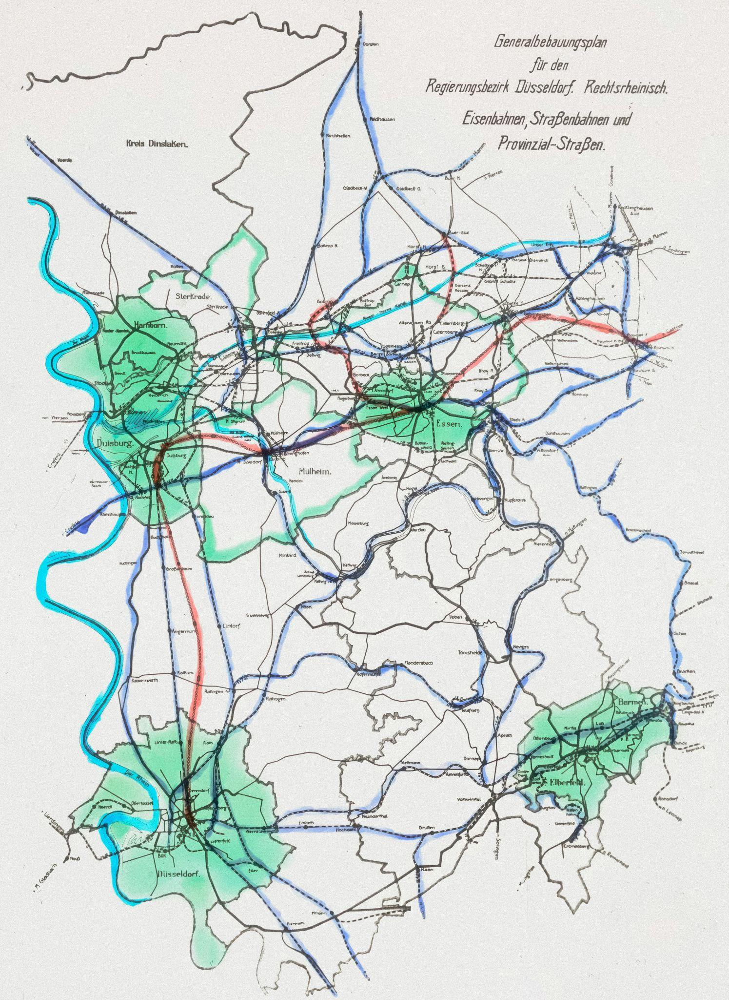
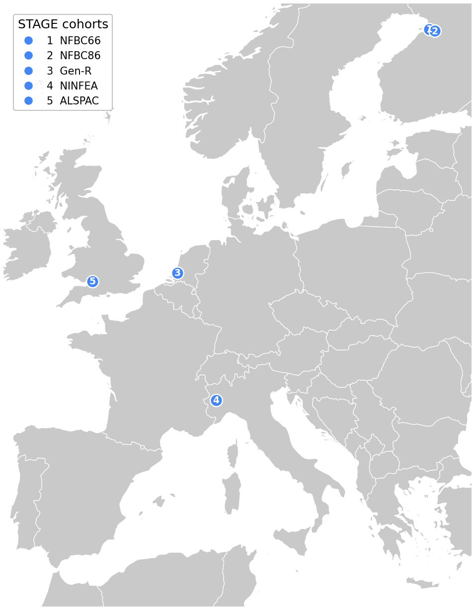
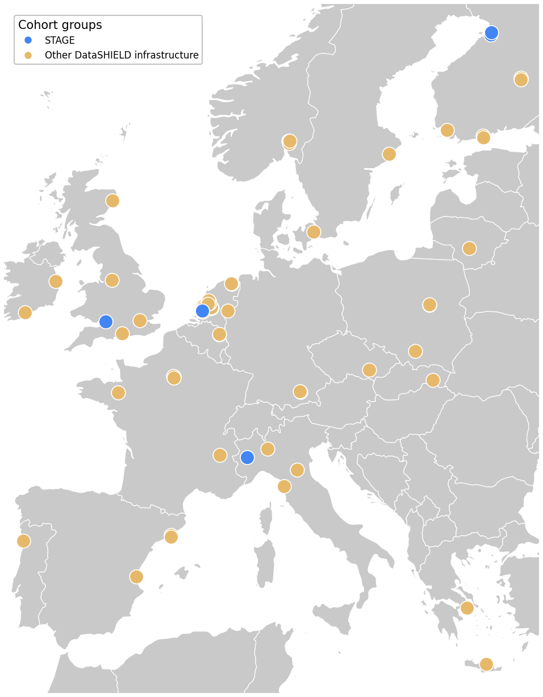

# Federated Analysis in STAGE
Possibilities and directions

  
<strong>Tim Cadman</strong>

  
Senior Data Scientist

  
  

---
layout: section
---

# Background

---
layout: content-two-cols
heading: Combining data
section: Background
subheading: 'Why'
---

<template #left>

- Large quantities of existing data already exist (e.g. cohort studies, biobanks)

- Combining data sources allows:
  - **Statistical power**
  - **Replication** across settings
  - **Extended coverage** of the lifecourse

</template>

<template #right>

</template>

---
layout: content
heading: Combining data
subheading: Lifecourse epidemiology
section: Background
---

  
Example research question: "How does early life chemical exposure affect later life cognitive decline?"

---
layout: content
heading: Combining data
subheading: "Scenario 1: One birth cohort"
section: Background
---

<svg width="655" height="320" viewBox="65 0 655 320" style="width: 100%; max-width: 560px; height: auto; margin: 0; display: block;">
  <!-- participant-count size legend, right-aligned -->
  <text style="font-size: 12px" x="300" y="22" fill="#555">Participants:</text>
  <circle cx="380" cy="18" r="4" fill="#888" fill-opacity="0.6" />
  <text style="font-size: 11px" x="388" y="22" fill="#555">&lt;1,000</text>
  <circle cx="470" cy="18" r="7" fill="#888" fill-opacity="0.6" />
  <text style="font-size: 11px" x="481" y="22" fill="#555">1,000–5,000</text>
  <circle cx="600" cy="18" r="10" fill="#888" fill-opacity="0.6" />
  <text style="font-size: 11px" x="614" y="22" fill="#555">&gt;5,000</text>

  <!-- row separator lines -->
  <line x1="140" y1="40" x2="700" y2="40" stroke="#eee" stroke-width="1" />
  <line x1="140" y1="84" x2="700" y2="84" stroke="#eee" stroke-width="1" />
  <line x1="140" y1="128" x2="700" y2="128" stroke="#eee" stroke-width="1" />
  <line x1="140" y1="172" x2="700" y2="172" stroke="#eee" stroke-width="1" />
  <line x1="140" y1="216" x2="700" y2="216" stroke="#eee" stroke-width="1" />
  <line x1="140" y1="260" x2="700" y2="260" stroke="#eee" stroke-width="1" />

  <!-- row labels — Cohorts 2-5 recoloured to match the background (present for
       alignment, not visible yet) so Cohort 1 sits in exactly the same place
       as it does once all 5 cohorts are shown -->
  <text style="font-size: 14px" x="130" y="66" fill="#0097A7" text-anchor="end">Cohort 1</text>
  <text style="font-size: 14px" x="130" y="110" fill="#ffffff" text-anchor="end">Cohort 2</text>
  <text style="font-size: 14px" x="130" y="154" fill="#ffffff" text-anchor="end">Cohort 3</text>
  <text style="font-size: 14px" x="130" y="198" fill="#ffffff" text-anchor="end">Cohort 4</text>
  <text style="font-size: 14px" x="130" y="242" fill="#ffffff" text-anchor="end">Cohort 5</text>

  <!-- Cohort 1 (teal): narrow, young adulthood -->
  <circle cx="252" cy="62" r="7" fill="#0097A7" fill-opacity="0.65" />
  <circle cx="277" cy="62" r="6" fill="#0097A7" fill-opacity="0.65" />
  <circle cx="308" cy="62" r="7" fill="#0097A7" fill-opacity="0.65" />
  <circle cx="345" cy="62" r="5" fill="#0097A7" fill-opacity="0.65" />

  <!-- Cohort 2 — hidden (matches background) -->
  <circle cx="152" cy="106" r="9" fill="#ffffff" />
  <circle cx="165" cy="106" r="10" fill="#ffffff" />
  <circle cx="177" cy="106" r="8" fill="#ffffff" />
  <circle cx="196" cy="106" r="7" fill="#ffffff" />
  <circle cx="215" cy="106" r="7" fill="#ffffff" />

  <!-- Cohort 3 — hidden (matches background) -->
  <circle cx="171" cy="150" r="9" fill="#ffffff" />
  <circle cx="202" cy="150" r="10" fill="#ffffff" />
  <circle cx="264" cy="150" r="7" fill="#ffffff" />
  <circle cx="327" cy="150" r="8" fill="#ffffff" />

  <!-- Cohort 4 — hidden (matches background), shifted to age 60-90 -->
  <circle cx="513" cy="194" r="5" fill="#ffffff" />
  <circle cx="563" cy="194" r="4" fill="#ffffff" />
  <circle cx="607" cy="194" r="5" fill="#ffffff" />
  <circle cx="650" cy="194" r="3" fill="#ffffff" />
  <circle cx="700" cy="194" r="4" fill="#ffffff" />

  <!-- Cohort 5 — hidden (matches background) -->
  <circle cx="233" cy="238" r="8" fill="#ffffff" />
  <circle cx="296" cy="238" r="6" fill="#ffffff" />
  <circle cx="376" cy="238" r="7" fill="#ffffff" />
  <circle cx="451" cy="238" r="5" fill="#ffffff" />
  <circle cx="526" cy="238" r="4" fill="#ffffff" />
  <circle cx="576" cy="238" r="3" fill="#ffffff" />

  <!-- x axis (age 0-90) -->
  <line x1="140" y1="270" x2="700" y2="270" stroke="#999" stroke-width="1.5" />
  <line x1="140" y1="270" x2="140" y2="275" stroke="#999" stroke-width="1.5" />
  <line x1="202" y1="270" x2="202" y2="275" stroke="#999" stroke-width="1.5" />
  <line x1="264" y1="270" x2="264" y2="275" stroke="#999" stroke-width="1.5" />
  <line x1="327" y1="270" x2="327" y2="275" stroke="#999" stroke-width="1.5" />
  <line x1="389" y1="270" x2="389" y2="275" stroke="#999" stroke-width="1.5" />
  <line x1="451" y1="270" x2="451" y2="275" stroke="#999" stroke-width="1.5" />
  <line x1="513" y1="270" x2="513" y2="275" stroke="#999" stroke-width="1.5" />
  <line x1="576" y1="270" x2="576" y2="275" stroke="#999" stroke-width="1.5" />
  <line x1="638" y1="270" x2="638" y2="275" stroke="#999" stroke-width="1.5" />
  <line x1="700" y1="270" x2="700" y2="275" stroke="#999" stroke-width="1.5" />
  <text style="font-size: 12px" x="140" y="286" fill="#666" text-anchor="middle">0</text>
  <text style="font-size: 12px" x="202" y="286" fill="#666" text-anchor="middle">10</text>
  <text style="font-size: 12px" x="264" y="286" fill="#666" text-anchor="middle">20</text>
  <text style="font-size: 12px" x="327" y="286" fill="#666" text-anchor="middle">30</text>
  <text style="font-size: 12px" x="389" y="286" fill="#666" text-anchor="middle">40</text>
  <text style="font-size: 12px" x="451" y="286" fill="#666" text-anchor="middle">50</text>
  <text style="font-size: 12px" x="513" y="286" fill="#666" text-anchor="middle">60</text>
  <text style="font-size: 12px" x="576" y="286" fill="#666" text-anchor="middle">70</text>
  <text style="font-size: 12px" x="638" y="286" fill="#666" text-anchor="middle">80</text>
  <text style="font-size: 12px" x="700" y="286" fill="#666" text-anchor="middle">90</text>
  <text style="font-size: 14px" x="420" y="304" fill="#555" text-anchor="middle">Age (years)</text>
</svg>

---
layout: content
heading: Combining data
subheading: "Scenario 1: One birth cohort"
section: Background
---

<svg width="655" height="320" viewBox="65 0 655 320" style="width: 100%; max-width: 560px; height: auto; margin: 0; display: block;">
  <!-- underlying cohort data points — only where Cohort 1 has observations (age 18-33) -->
  <circle cx="264" cy="105" r="3.5" fill="#999" fill-opacity="0.4" />
  <circle cx="296" cy="112" r="3.5" fill="#999" fill-opacity="0.4" />
  <circle cx="327" cy="102" r="3.5" fill="#999" fill-opacity="0.4" />

  <!-- fitted trajectories: only drawn over the observed period (age 18-33) -->
  <path d="M252,85 L345,89" fill="none" stroke="#0097A7" stroke-width="3" stroke-linecap="round" />
  <path d="M252,97 L345,109" fill="none" stroke="#E6B96A" stroke-width="3" stroke-linecap="round" />
  <path d="M252,114 L345,136" fill="none" stroke="#D9534F" stroke-width="3" stroke-linecap="round" />

  <!-- axes -->
  <line x1="140" y1="40" x2="140" y2="260" stroke="#999" stroke-width="1.5" />
  <line x1="140" y1="260" x2="700" y2="260" stroke="#999" stroke-width="1.5" />
  <line x1="140" y1="260" x2="140" y2="265" stroke="#999" stroke-width="1.5" />
  <line x1="202" y1="260" x2="202" y2="265" stroke="#999" stroke-width="1.5" />
  <line x1="264" y1="260" x2="264" y2="265" stroke="#999" stroke-width="1.5" />
  <line x1="327" y1="260" x2="327" y2="265" stroke="#999" stroke-width="1.5" />
  <line x1="389" y1="260" x2="389" y2="265" stroke="#999" stroke-width="1.5" />
  <line x1="451" y1="260" x2="451" y2="265" stroke="#999" stroke-width="1.5" />
  <line x1="513" y1="260" x2="513" y2="265" stroke="#999" stroke-width="1.5" />
  <line x1="576" y1="260" x2="576" y2="265" stroke="#999" stroke-width="1.5" />
  <line x1="638" y1="260" x2="638" y2="265" stroke="#999" stroke-width="1.5" />
  <line x1="700" y1="260" x2="700" y2="265" stroke="#999" stroke-width="1.5" />
  <text style="font-size: 12px" x="140" y="276" fill="#666" text-anchor="middle">0</text>
  <text style="font-size: 12px" x="202" y="276" fill="#666" text-anchor="middle">10</text>
  <text style="font-size: 12px" x="264" y="276" fill="#666" text-anchor="middle">20</text>
  <text style="font-size: 12px" x="327" y="276" fill="#666" text-anchor="middle">30</text>
  <text style="font-size: 12px" x="389" y="276" fill="#666" text-anchor="middle">40</text>
  <text style="font-size: 12px" x="451" y="276" fill="#666" text-anchor="middle">50</text>
  <text style="font-size: 12px" x="513" y="276" fill="#666" text-anchor="middle">60</text>
  <text style="font-size: 12px" x="576" y="276" fill="#666" text-anchor="middle">70</text>
  <text style="font-size: 12px" x="638" y="276" fill="#666" text-anchor="middle">80</text>
  <text style="font-size: 12px" x="700" y="276" fill="#666" text-anchor="middle">90</text>
  <text style="font-size: 14px" x="420" y="294" fill="#555" text-anchor="middle">Age (years)</text>
  <text style="font-size: 14px" x="0" y="0" fill="#555" text-anchor="middle" transform="translate(120,150) rotate(-90)">Cognitive function</text>

  <!-- legend -->
  <line x1="270" y1="20" x2="290" y2="20" stroke="#0097A7" stroke-width="4" stroke-linecap="round" />
  <text style="font-size: 13px" x="296" y="24" fill="#333">Low exposure</text>
  <line x1="400" y1="20" x2="420" y2="20" stroke="#E6B96A" stroke-width="4" stroke-linecap="round" />
  <text style="font-size: 13px" x="426" y="24" fill="#333">Medium exposure</text>
  <line x1="560" y1="20" x2="580" y2="20" stroke="#D9534F" stroke-width="4" stroke-linecap="round" />
  <text style="font-size: 13px" x="586" y="24" fill="#333">High exposure</text>
</svg>

---
layout: content
heading: Combining data
subheading: "Scenario 2: Combining data from birth cohorts"
section: Background
---

<svg width="655" height="320" viewBox="65 0 655 320" style="width: 100%; max-width: 560px; height: auto; margin: 0; display: block;">
  <!-- participant-count size legend, right-aligned -->
  <text style="font-size: 12px" x="300" y="22" fill="#555">Participants:</text>
  <circle cx="380" cy="18" r="4" fill="#888" fill-opacity="0.6" />
  <text style="font-size: 11px" x="388" y="22" fill="#555">&lt;1,000</text>
  <circle cx="470" cy="18" r="7" fill="#888" fill-opacity="0.6" />
  <text style="font-size: 11px" x="481" y="22" fill="#555">1,000–5,000</text>
  <circle cx="600" cy="18" r="10" fill="#888" fill-opacity="0.6" />
  <text style="font-size: 11px" x="614" y="22" fill="#555">&gt;5,000</text>

  <!-- row separator lines -->
  <line x1="140" y1="40" x2="700" y2="40" stroke="#eee" stroke-width="1" />
  <line x1="140" y1="84" x2="700" y2="84" stroke="#eee" stroke-width="1" />
  <line x1="140" y1="128" x2="700" y2="128" stroke="#eee" stroke-width="1" />
  <line x1="140" y1="172" x2="700" y2="172" stroke="#eee" stroke-width="1" />
  <line x1="140" y1="216" x2="700" y2="216" stroke="#eee" stroke-width="1" />
  <line x1="140" y1="260" x2="700" y2="260" stroke="#eee" stroke-width="1" />

  <!-- row labels, coloured per cohort (deck palette) -->
  <text style="font-size: 14px" x="130" y="66" fill="#0097A7" text-anchor="end">Cohort 1</text>
  <text style="font-size: 14px" x="130" y="110" fill="#B9852A" text-anchor="end">Cohort 2</text>
  <text style="font-size: 14px" x="130" y="154" fill="#D9534F" text-anchor="end">Cohort 3</text>
  <text style="font-size: 14px" x="130" y="198" fill="#6A4C93" text-anchor="end">Cohort 4</text>
  <text style="font-size: 14px" x="130" y="242" fill="#4285F4" text-anchor="end">Cohort 5</text>

  <!-- Cohort 1 (teal): narrow, young adulthood -->
  <circle cx="252" cy="62" r="7" fill="#0097A7" fill-opacity="0.65" />
  <circle cx="277" cy="62" r="6" fill="#0097A7" fill-opacity="0.65" />
  <circle cx="308" cy="62" r="7" fill="#0097A7" fill-opacity="0.65" />
  <circle cx="345" cy="62" r="5" fill="#0097A7" fill-opacity="0.65" />

  <!-- Cohort 2 (gold): narrow, skewed young (childhood only) -->
  <circle cx="152" cy="106" r="9" fill="#E6B96A" fill-opacity="0.8" />
  <circle cx="165" cy="106" r="10" fill="#E6B96A" fill-opacity="0.8" />
  <circle cx="177" cy="106" r="8" fill="#E6B96A" fill-opacity="0.8" />
  <circle cx="196" cy="106" r="7" fill="#E6B96A" fill-opacity="0.8" />
  <circle cx="215" cy="106" r="7" fill="#E6B96A" fill-opacity="0.8" />

  <!-- Cohort 3 (red): young/early adulthood -->
  <circle cx="171" cy="150" r="9" fill="#D9534F" fill-opacity="0.65" />
  <circle cx="202" cy="150" r="10" fill="#D9534F" fill-opacity="0.65" />
  <circle cx="264" cy="150" r="7" fill="#D9534F" fill-opacity="0.65" />
  <circle cx="327" cy="150" r="8" fill="#D9534F" fill-opacity="0.65" />

  <!-- Cohort 4 (purple): skewed older, age 60-90 -->
  <circle cx="513" cy="194" r="5" fill="#6A4C93" fill-opacity="0.65" />
  <circle cx="563" cy="194" r="4" fill="#6A4C93" fill-opacity="0.65" />
  <circle cx="607" cy="194" r="5" fill="#6A4C93" fill-opacity="0.65" />
  <circle cx="650" cy="194" r="3" fill="#6A4C93" fill-opacity="0.65" />
  <circle cx="700" cy="194" r="4" fill="#6A4C93" fill-opacity="0.65" />

  <!-- Cohort 5 (blue): wide-ish, sparser, older-skewed -->
  <circle cx="233" cy="238" r="8" fill="#4285F4" fill-opacity="0.65" />
  <circle cx="296" cy="238" r="6" fill="#4285F4" fill-opacity="0.65" />
  <circle cx="376" cy="238" r="7" fill="#4285F4" fill-opacity="0.65" />
  <circle cx="451" cy="238" r="5" fill="#4285F4" fill-opacity="0.65" />
  <circle cx="526" cy="238" r="4" fill="#4285F4" fill-opacity="0.65" />
  <circle cx="576" cy="238" r="3" fill="#4285F4" fill-opacity="0.65" />

  <!-- x axis (age 0-90) -->
  <line x1="140" y1="270" x2="700" y2="270" stroke="#999" stroke-width="1.5" />
  <line x1="140" y1="270" x2="140" y2="275" stroke="#999" stroke-width="1.5" />
  <line x1="202" y1="270" x2="202" y2="275" stroke="#999" stroke-width="1.5" />
  <line x1="264" y1="270" x2="264" y2="275" stroke="#999" stroke-width="1.5" />
  <line x1="327" y1="270" x2="327" y2="275" stroke="#999" stroke-width="1.5" />
  <line x1="389" y1="270" x2="389" y2="275" stroke="#999" stroke-width="1.5" />
  <line x1="451" y1="270" x2="451" y2="275" stroke="#999" stroke-width="1.5" />
  <line x1="513" y1="270" x2="513" y2="275" stroke="#999" stroke-width="1.5" />
  <line x1="576" y1="270" x2="576" y2="275" stroke="#999" stroke-width="1.5" />
  <line x1="638" y1="270" x2="638" y2="275" stroke="#999" stroke-width="1.5" />
  <line x1="700" y1="270" x2="700" y2="275" stroke="#999" stroke-width="1.5" />
  <text style="font-size: 12px" x="140" y="286" fill="#666" text-anchor="middle">0</text>
  <text style="font-size: 12px" x="202" y="286" fill="#666" text-anchor="middle">10</text>
  <text style="font-size: 12px" x="264" y="286" fill="#666" text-anchor="middle">20</text>
  <text style="font-size: 12px" x="327" y="286" fill="#666" text-anchor="middle">30</text>
  <text style="font-size: 12px" x="389" y="286" fill="#666" text-anchor="middle">40</text>
  <text style="font-size: 12px" x="451" y="286" fill="#666" text-anchor="middle">50</text>
  <text style="font-size: 12px" x="513" y="286" fill="#666" text-anchor="middle">60</text>
  <text style="font-size: 12px" x="576" y="286" fill="#666" text-anchor="middle">70</text>
  <text style="font-size: 12px" x="638" y="286" fill="#666" text-anchor="middle">80</text>
  <text style="font-size: 12px" x="700" y="286" fill="#666" text-anchor="middle">90</text>
  <text style="font-size: 14px" x="420" y="304" fill="#555" text-anchor="middle">Age (years)</text>
</svg>

---
layout: content
heading: Combining data
subheading: "Scenario 2: Combining data from birth cohorts"
section: Background
---

<svg width="655" height="320" viewBox="65 0 655 320" style="width: 100%; max-width: 560px; height: auto; margin: 0; display: block;">
  <!-- underlying cohort data points (raw measurements feeding the model), age 0-90 -->
  <circle cx="140" cy="78" r="3.5" fill="#999" fill-opacity="0.4" />
  <circle cx="152" cy="92" r="3.5" fill="#999" fill-opacity="0.4" />
  <circle cx="177" cy="86" r="3.5" fill="#999" fill-opacity="0.4" />
  <circle cx="202" cy="100" r="3.5" fill="#999" fill-opacity="0.4" />
  <circle cx="233" cy="95" r="3.5" fill="#999" fill-opacity="0.4" />
  <circle cx="264" cy="110" r="3.5" fill="#999" fill-opacity="0.4" />
  <circle cx="296" cy="120" r="3.5" fill="#999" fill-opacity="0.4" />
  <circle cx="327" cy="105" r="3.5" fill="#999" fill-opacity="0.4" />
  <circle cx="358" cy="135" r="3.5" fill="#999" fill-opacity="0.4" />
  <circle cx="389" cy="125" r="3.5" fill="#999" fill-opacity="0.4" />
  <circle cx="420" cy="150" r="3.5" fill="#999" fill-opacity="0.4" />
  <circle cx="451" cy="140" r="3.5" fill="#999" fill-opacity="0.4" />
  <circle cx="482" cy="165" r="3.5" fill="#999" fill-opacity="0.4" />
  <circle cx="513" cy="155" r="3.5" fill="#999" fill-opacity="0.4" />
  <circle cx="544" cy="180" r="3.5" fill="#999" fill-opacity="0.4" />
  <circle cx="576" cy="170" r="3.5" fill="#999" fill-opacity="0.4" />
  <circle cx="625" cy="195" r="3.5" fill="#999" fill-opacity="0.4" />
  <circle cx="681" cy="205" r="3.5" fill="#999" fill-opacity="0.4" />

  <!-- fitted trajectory curves, one per exposure level, age 0-90 -->
  <path d="M140,80 C202,80 265,88 327,88 C378,88 431,100 482,100 C513,100 545,108 576,108 C617,108 659,114 700,114"
        fill="none" stroke="#0097A7" stroke-width="3" stroke-linecap="round" />
  <path d="M140,85 C202,85 265,105 327,105 C378,105 431,140 482,140 C513,140 545,160 576,160 C617,160 659,180 700,180"
        fill="none" stroke="#E6B96A" stroke-width="3" stroke-linecap="round" />
  <path d="M140,90 C202,90 265,130 327,130 C378,130 431,185 482,185 C513,185 545,215 576,215 C617,215 659,250 700,250"
        fill="none" stroke="#D9534F" stroke-width="3" stroke-linecap="round" />

  <!-- axes -->
  <line x1="140" y1="40" x2="140" y2="260" stroke="#999" stroke-width="1.5" />
  <line x1="140" y1="260" x2="700" y2="260" stroke="#999" stroke-width="1.5" />
  <line x1="140" y1="260" x2="140" y2="265" stroke="#999" stroke-width="1.5" />
  <line x1="202" y1="260" x2="202" y2="265" stroke="#999" stroke-width="1.5" />
  <line x1="264" y1="260" x2="264" y2="265" stroke="#999" stroke-width="1.5" />
  <line x1="327" y1="260" x2="327" y2="265" stroke="#999" stroke-width="1.5" />
  <line x1="389" y1="260" x2="389" y2="265" stroke="#999" stroke-width="1.5" />
  <line x1="451" y1="260" x2="451" y2="265" stroke="#999" stroke-width="1.5" />
  <line x1="513" y1="260" x2="513" y2="265" stroke="#999" stroke-width="1.5" />
  <line x1="576" y1="260" x2="576" y2="265" stroke="#999" stroke-width="1.5" />
  <line x1="638" y1="260" x2="638" y2="265" stroke="#999" stroke-width="1.5" />
  <line x1="700" y1="260" x2="700" y2="265" stroke="#999" stroke-width="1.5" />
  <text style="font-size: 12px" x="140" y="276" fill="#666" text-anchor="middle">0</text>
  <text style="font-size: 12px" x="202" y="276" fill="#666" text-anchor="middle">10</text>
  <text style="font-size: 12px" x="264" y="276" fill="#666" text-anchor="middle">20</text>
  <text style="font-size: 12px" x="327" y="276" fill="#666" text-anchor="middle">30</text>
  <text style="font-size: 12px" x="389" y="276" fill="#666" text-anchor="middle">40</text>
  <text style="font-size: 12px" x="451" y="276" fill="#666" text-anchor="middle">50</text>
  <text style="font-size: 12px" x="513" y="276" fill="#666" text-anchor="middle">60</text>
  <text style="font-size: 12px" x="576" y="276" fill="#666" text-anchor="middle">70</text>
  <text style="font-size: 12px" x="638" y="276" fill="#666" text-anchor="middle">80</text>
  <text style="font-size: 12px" x="700" y="276" fill="#666" text-anchor="middle">90</text>
  <text style="font-size: 14px" x="420" y="294" fill="#555" text-anchor="middle">Age (years)</text>
  <text style="font-size: 14px" x="0" y="0" fill="#555" text-anchor="middle" transform="translate(120,150) rotate(-90)">Cognitive function</text>

  <!-- legend -->
  <line x1="270" y1="20" x2="290" y2="20" stroke="#0097A7" stroke-width="4" stroke-linecap="round" />
  <text style="font-size: 13px" x="296" y="24" fill="#333">Low exposure</text>
  <line x1="400" y1="20" x2="420" y2="20" stroke="#E6B96A" stroke-width="4" stroke-linecap="round" />
  <text style="font-size: 13px" x="426" y="24" fill="#333">Medium exposure</text>
  <line x1="560" y1="20" x2="580" y2="20" stroke="#D9534F" stroke-width="4" stroke-linecap="round" />
  <text style="font-size: 13px" x="586" y="24" fill="#333">High exposure</text>
</svg>

---
layout: content
heading: Combining data
subheading: How
section: Background
---

  

    

      <h3>Move data to one location</h3>
    

    

      <h3>Share script, meta-analysis</h3>
    

    
= 2 }">
      <h3>Federated Analysis</h3>
      
= 3" style="margin: 0.4rem 0 0 0; font-size: 13px; font-weight: 400; color: #777;">"Remote analysis without data transfer"

    

  

  

  

  

  <svg viewBox="0 0 300 208" style="position: absolute; inset: 0; width: 100%; height: 100%;">
  <defs>
  <marker id="cd-arrow-1" viewBox="0 0 10 10" refX="8" refY="5" markerWidth="5" markerHeight="5" orient="auto-start-reverse">
  <path d="M0,0 L10,5 L0,10 z" fill="#4285F4" />
  </marker>
  </defs>
  <line x1="100" y1="41.5" x2="170.44" y2="94.85" stroke="#4285F4" stroke-width="2" marker-end="url(#cd-arrow-1)" />
  <line x1="100" y1="102.1" x2="168" y2="102.1" stroke="#4285F4" stroke-width="2" marker-end="url(#cd-arrow-1)" />
  <line x1="100" y1="162.7" x2="170.44" y2="109.35" stroke="#4285F4" stroke-width="2" marker-end="url(#cd-arrow-1)" />
  </svg>
  

  Site A
  
  

  

  Site B
  
  

  

  Site C
  
  

  
  <!-- No laptop icon asset exists in this deck, so drawn in CSS: a screen
       (bordered rectangle) over a base (filled bar), same 43px height as the
       site icons, centred on the same y as the researcher/site-B row. -->
  

  

  

  

  

  

  <svg viewBox="0 0 300 208" style="position: absolute; inset: 0; width: 100%; height: 100%;">
  <defs>
  <marker id="cd-arrow-2" viewBox="0 0 10 10" refX="8" refY="5" markerWidth="5" markerHeight="5" orient="auto-start-reverse">
  <path d="M0,0 L10,5 L0,10 z" fill="#4285F4" />
  </marker>
  <marker id="cd-arrow-2-gold" viewBox="0 0 10 10" refX="8" refY="5" markerWidth="5" markerHeight="5" orient="auto-start-reverse">
  <path d="M0,0 L10,5 L0,10 z" fill="#E6B96A" />
  </marker>
  </defs>
  <!-- Script out: researcher to each site -->
  <line x1="170.44" y1="94.85" x2="100" y2="41.5" stroke="#4285F4" stroke-width="2" marker-end="url(#cd-arrow-2)" />
  <line x1="168" y1="102.1" x2="100" y2="102.1" stroke="#4285F4" stroke-width="2" marker-end="url(#cd-arrow-2)" />
  <line x1="170.44" y1="109.35" x2="100" y2="162.7" stroke="#4285F4" stroke-width="2" marker-end="url(#cd-arrow-2)" />
  <!-- Combined results back: one arc from the site cluster to the researcher,
       routed below the outbound lines so it doesn't cross them. Gold, to
       stand out from the (blue) outbound script lines. -->
  <path d="M 60,184 C 60,205 207,205 207,135" stroke="#E6B96A" stroke-width="2" fill="none" marker-end="url(#cd-arrow-2-gold)" />
  </svg>
  

  Site A
  
  

  

  Site B
  
  

  

  Site C
  
  

  
  

  

  

  

  

  

  

  

  

  

  

  

  <!-- Stacked-documents icon on the return arc: combined/aggregated results
       from all sites (as opposed to the single script paper on the way out). -->
  

  

  

  

  

  

  

  

  

  
= 2" style="position: absolute; inset: 0;">
  <svg viewBox="0 0 300 208" style="position: absolute; inset: 0; width: 100%; height: 100%;">
  <defs>
  <marker id="cd-arrow-3" viewBox="0 0 10 10" refX="8" refY="5" markerWidth="5" markerHeight="5" orient="auto-start-reverse">
  <path d="M0,0 L10,5 L0,10 z" fill="#4285F4" />
  </marker>
  <marker id="cd-arrow-3-gold" viewBox="0 0 10 10" refX="8" refY="5" markerWidth="5" markerHeight="5" orient="auto-start-reverse">
  <path d="M0,0 L10,5 L0,10 z" fill="#E6B96A" />
  </marker>
  </defs>
  <!-- Same blue lines/coordinates as diagram 1 (data->researcher), but
       pointing researcher->data (marker-start, not marker-end) — federated
       analysis sends commands to the data, not the other way round. -->
  <line x1="100" y1="41.5" x2="170.44" y2="94.85" stroke="#4285F4" stroke-width="2" marker-start="url(#cd-arrow-3)" />
  <line x1="100" y1="102.1" x2="168" y2="102.1" stroke="#4285F4" stroke-width="2" marker-start="url(#cd-arrow-3)" />
  <line x1="100" y1="162.7" x2="170.44" y2="109.35" stroke="#4285F4" stroke-width="2" marker-start="url(#cd-arrow-3)" />
  <!-- Same gold return arc as diagram 2, same path/endpoint (researcher is
       back at its usual position here), just with a code glyph on it
       instead of the stacked-documents icon. -->
  <path d="M 60,184 C 60,205 207,205 207,135" stroke="#E6B96A" stroke-width="2" fill="none" marker-end="url(#cd-arrow-3-gold)" />
  </svg>
  

  Site A
  
  

  

  Site B
  
  

  

  Site C
  
  

  <!-- Code glyphs sit above each line's midpoint (instead of the paper/script
       icon — federated analysis runs code interactively rather than passing
       documents), and a larger one above the return arc, replacing diagram 2's
       stacked-documents icon. Line A/B/C midpoints are (140,71.8)/(140,102.1)/(140,132.4). -->
  

  &lt;/&gt;
  

  

  &lt;/&gt;
  

  

  &lt;/&gt;
  

  

  &lt;/&gt;
  

  <!-- Researcher back in its usual position (lines above terminate here);
       computer symbol to its right, representing the analysis platform they
       run federated queries from. -->
  
  <!-- No laptop icon asset exists in this deck, so drawn in CSS: a screen
       (bordered rectangle) over a base (filled bar), same 43px height as the
       site icons, centred on the same y as the researcher/site-B row. -->
  

  

  

  

  

---
layout: content
heading: Combining data
subheading: "Option 1: Data transfer"
section: Background
---

  

  

  <svg viewBox="0 0 300 208" style="position: absolute; inset: 0; width: 100%; height: 100%;">
  <defs>
  <marker id="cd-arrow-o1" viewBox="0 0 10 10" refX="8" refY="5" markerWidth="5" markerHeight="5" orient="auto-start-reverse">
  <path d="M0,0 L10,5 L0,10 z" fill="#4285F4" />
  </marker>
  </defs>
  <line x1="100" y1="41.5" x2="170.44" y2="94.85" stroke="#4285F4" stroke-width="2" marker-end="url(#cd-arrow-o1)" />
  <line x1="100" y1="102.1" x2="168" y2="102.1" stroke="#4285F4" stroke-width="2" marker-end="url(#cd-arrow-o1)" />
  <line x1="100" y1="162.7" x2="170.44" y2="109.35" stroke="#4285F4" stroke-width="2" marker-end="url(#cd-arrow-o1)" />
  </svg>
  

  Site A
  
  

  

  Site B
  
  

  

  Site C
  
  

  
  <!-- No laptop icon asset exists in this deck, so drawn in CSS: a screen
       (bordered rectangle) over a base (filled bar), same 43px height as the
       site icons, centred on the same y as the researcher/site-B row. -->
  

  

  

  

  

  

  

    <ul style="padding-left: 1.5rem; margin: 0;">
      <li style="font-size: 18px; margin-bottom: 0.5rem; line-height: 1.5;"><strong>Strategy:</strong> Transfer to one location</li>
      <li style="font-size: 18px; margin-bottom: 0.5rem; line-height: 1.5;"><strong>Pros:</strong> One researcher conducts all analyses</li>
      <li style="font-size: 18px; margin-bottom: 0.5rem; line-height: 1.5;"><strong>Cons:</strong>
        <ul style="padding-left: 1.5rem; margin: 0.3rem 0 0 0;">
          <li style="font-size: 18px; margin-bottom: 0.3rem; line-height: 1.5;">Ethico-legal restrictions</li>
          <li style="font-size: 18px; margin-bottom: 0.3rem; line-height: 1.5;">Data owners lose control of data</li>
          <li style="font-size: 18px; margin-bottom: 0.3rem; line-height: 1.5;">Storage demands (e.g. omics)</li>
        </ul>
      </li>
    </ul>
  

---
layout: content
heading: Combining data
subheading: "Option 2: Share script, meta-analysis"
section: Background
---

  

  

  <svg viewBox="0 0 300 208" style="position: absolute; inset: 0; width: 100%; height: 100%;">
  <defs>
  <marker id="cd-arrow-o2" viewBox="0 0 10 10" refX="8" refY="5" markerWidth="5" markerHeight="5" orient="auto-start-reverse">
  <path d="M0,0 L10,5 L0,10 z" fill="#4285F4" />
  </marker>
  <marker id="cd-arrow-o2-gold" viewBox="0 0 10 10" refX="8" refY="5" markerWidth="5" markerHeight="5" orient="auto-start-reverse">
  <path d="M0,0 L10,5 L0,10 z" fill="#E6B96A" />
  </marker>
  </defs>
  <line x1="170.44" y1="94.85" x2="100" y2="41.5" stroke="#4285F4" stroke-width="2" marker-end="url(#cd-arrow-o2)" />
  <line x1="168" y1="102.1" x2="100" y2="102.1" stroke="#4285F4" stroke-width="2" marker-end="url(#cd-arrow-o2)" />
  <line x1="170.44" y1="109.35" x2="100" y2="162.7" stroke="#4285F4" stroke-width="2" marker-end="url(#cd-arrow-o2)" />
  <path d="M 60,184 C 60,205 207,205 207,135" stroke="#E6B96A" stroke-width="2" fill="none" marker-end="url(#cd-arrow-o2-gold)" />
  </svg>
  

  Site A
  
  

  

  Site B
  
  

  

  Site C
  
  

  
  

  

  

  

  

  

  

  

  

  

  

  

  

  

  

  

  

  

  

  

  

  

  

    <ul style="padding-left: 1.5rem; margin: 0;">
      <li style="font-size: 18px; margin-bottom: 0.5rem; line-height: 1.5;"><strong>Strategy:</strong> Send analysis script to each site; combine returned results</li>
      <li style="font-size: 18px; margin-bottom: 0.5rem; line-height: 1.5;"><strong>Pros:</strong> No sharing of data</li>
      <li style="font-size: 18px; margin-bottom: 0.5rem; line-height: 1.5;"><strong>Cons:</strong>
        <ul style="padding-left: 1.5rem; margin: 0.3rem 0 0 0;">
          <li style="font-size: 18px; margin-bottom: 0.3rem; line-height: 1.5;">Inefficient</li>
          <li style="font-size: 18px; margin-bottom: 0.3rem; line-height: 1.5;">Limited to two-stage methods</li>
        </ul>
      </li>
    </ul>
  

---
layout: content
heading: Combining data
subheading: "Option 3: Federated analysis"
section: Background
---

  

  

  <svg viewBox="0 0 300 208" style="position: absolute; inset: 0; width: 100%; height: 100%;">
  <defs>
  <marker id="cd-arrow-o3" viewBox="0 0 10 10" refX="8" refY="5" markerWidth="5" markerHeight="5" orient="auto-start-reverse">
  <path d="M0,0 L10,5 L0,10 z" fill="#4285F4" />
  </marker>
  <marker id="cd-arrow-o3-gold" viewBox="0 0 10 10" refX="8" refY="5" markerWidth="5" markerHeight="5" orient="auto-start-reverse">
  <path d="M0,0 L10,5 L0,10 z" fill="#E6B96A" />
  </marker>
  </defs>
  <line x1="100" y1="41.5" x2="170.44" y2="94.85" stroke="#4285F4" stroke-width="2" marker-start="url(#cd-arrow-o3)" />
  <line x1="100" y1="102.1" x2="168" y2="102.1" stroke="#4285F4" stroke-width="2" marker-start="url(#cd-arrow-o3)" />
  <line x1="100" y1="162.7" x2="170.44" y2="109.35" stroke="#4285F4" stroke-width="2" marker-start="url(#cd-arrow-o3)" />
  <path d="M 60,184 C 60,205 207,205 207,135" stroke="#E6B96A" stroke-width="2" fill="none" marker-end="url(#cd-arrow-o3-gold)" />
  </svg>
  

  Site A
  
  

  

  Site B
  
  

  

  Site C
  
  

  

  &lt;/&gt;
  

  

  &lt;/&gt;
  

  

  &lt;/&gt;
  

  

  &lt;/&gt;
  

  
  

  

  

  

  

  

  

    <ul style="padding-left: 1.5rem; margin: 0;">
      <li style="font-size: 18px; margin-bottom: 0.5rem; line-height: 1.5;"><strong>Strategy:</strong> Send analysis code to the data; only aggregate results return</li>
      <li style="font-size: 18px; margin-bottom: 0.5rem; line-height: 1.5;"><strong>Pros:</strong> Data never leaves its location; owners keep control and access rights</li>
      <li style="font-size: 18px; margin-bottom: 0.5rem; line-height: 1.5;"><strong>Cons:</strong>
        <ul style="padding-left: 1.5rem; margin: 0.3rem 0 0 0;">
          <li style="font-size: 18px; margin-bottom: 0.3rem; line-height: 1.5;">Needs common infrastructure</li>
          <li style="font-size: 18px; margin-bottom: 0.3rem; line-height: 1.5;">Fewer analysis options than pooling</li>
        </ul>
      </li>
    </ul>
  

---
layout: section
---

# Federated Analysis

---
layout: content
heading: What is it
subheading: 
section: Federated Analysis
---

- Analysis code — not raw data — is sent to where each dataset is stored
- Each site runs the computation **locally, on its own data**
- Only **non-disclosive, aggregate results** (summary statistics or model updates) are returned
- Data never leaves its original location — governance, access control and ownership stay with the data holder

---
layout: content
heading: How it works
subheading: 
section: Federated Analysis
---

<DatashieldArchitectureSimple />

---
layout: content
heading: Different frameworks
subheading: 
section: Federated Analysis
---

  

    <h3>Pipeline</h3>
    
Submit a job once, receive results

    

      

        
        Flower
      

      

        
        Vantage6
      

    

  

  
= 1 }">
    <h3>Work interactively</h3>
    
Researcher runs analyses as if working locally

    

      

        
      

    

  

---
layout: content
heading: DataSHIELD
subheading: Analysis options
section: Federated Analysis
---

  

    <h3>Core functions & data preparation</h3>
    
Data manipulation

    
Generalised Linear Models

    
Mixed effects

  

  

    <h3>Causal & regression analysis</h3>
    
Cox Models

    
Causal Mediation

  

  

    <h3>Machine learning</h3>
    
Machine Learning

  

  

    <h3>Omics, microbiome, exposome</h3>
    
Omics

    
Exposome

  

---
layout: section
---

# Existing infrastructure

---
layout: chart-full
heading: STAGE DataSHIELD nodes
---

  
  

    <ul style="padding-left: 1.5rem; margin: 0;">
      <li style="font-size: 18px; margin-bottom: 0.5rem; line-height: 1.5;">5 STAGE cohorts are established DataSHIELD nodes.</li>
    </ul>
  

---
layout: chart-full
heading: European DataSHIELD nodes
---

  
  

    <ul style="padding-left: 1.5rem; margin: 0;">
      <li style="font-size: 18px; margin-bottom: 0.5rem; line-height: 1.5;">5 STAGE cohorts are established DataSHIELD nodes.</li>
      <li style="font-size: 18px; margin-bottom: 0.5rem; line-height: 1.5;">There are also many other EU nodes from diverse projects.</li>
      <li style="font-size: 18px; margin-bottom: 0.5rem; line-height: 1.5;">This gives possibilities to connect analyses to additional data sources.</li>
    </ul>
  

---
layout: section
---

# STAGE projects

---
layout: content
heading: Planned projects
subheading:
section: STAGE projects
---

- WP4 — federated k-NN matched survey regression
- WP6 - Multimorbidity AI models
- WP5 — OMICS analysis
- WP5 — biological clocks

---
layout: content
heading: New projects
subheading:
section: STAGE projects
---

**Data owners**
- If you want to set up a federated node — we can provide technical support

Researchers

- If you have a project for which federated analysis could be a solution, we can offer training

---
layout: section
---

# Discussion

---
layout: content
heading: Discussion
subheading: 
section: Discussion
---

<v-clicks>

- Federated analysis gives an alternative to data transfer and sharing scripts
- Several STAGE cohorts are aready part of a large EU federated network
- UMCG can provide training and technical support
- Planned develpments: extend infrastructure to Flower protocol for AI and Machine Learning
- We can also help develop new functionality for specific STAGE projects if required

</v-clicks>

---
layout: content
heading: Questions?
subheading: ""
section: Discussion
---

---
layout: content
heading: Further Information
subheading: ""
section: Discussion
---

For questions and support contact: <strong>support@molgenis.org</strong>

**Useful links:**
- DataSHIELD wiki: https://wiki.datashield.org/
- DataSHIELD website: https://datashield.org/
- Flower website: https://flower.ai/
- Molgenis suite: https://molgenis.org/

